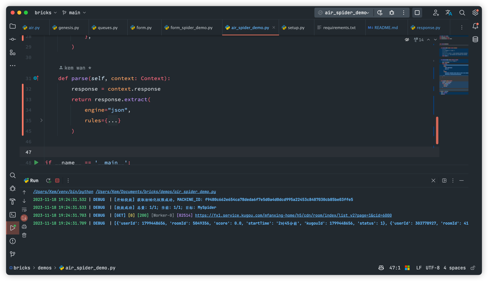

# bricks

Bricks 是一个为了快速构建爬虫项目并进行统一管理部署而编写的应用框架。可以应用在包括数据挖掘，数据提取，状态监控，交互控制等一系列程序中。适用于页面抓取及应用
API 数据抓取等通用网络爬虫。

Bricks 拥有以下特性

快速构建爬虫

- 丰富的事件接口，可以在预留的接口内插入自定义事件，拓展你的应用
- 强大的爬虫基类，可以纯代码式编程，也可以配置化编程
- 丰富的解析器，包括 json / xpath / jsonpath / regex / json / 自定义
- 下载器可拓展，目前内置的下载器为 curl-cffi ，你也可以自定义拓展
- 灵活的调度器，调度器支持提交同步任务和异步任务，Worker 可以自动调节与释放

安装

```
pip install bricks-py==0.0.1
```

# 简单上手

## 需求声明

网站: [酷狗直播热门游戏主播列表](https://fx1.service.kugou.com/mfanxing-home/h5/cdn/room/index/list\_v2?page=1\&cid=6000)

需求：获取主播的 ID、昵称、房间号、直播状态、评分、开始直播的时间等信息

## 接口分析

接口地址： `https://fx1.service.kugou.com/mfanxing-home/h5/cdn/room/index/list_v2?page=1&cid=6000`

接口参数：

* `cid` 为固定的参数
* `page` 代表当前页数，因此我们请求时需要变化的仅有：`page` 参数

响应示例：

```json
{
  "code": 0,
  "data": {
    "hasNextPage": 1,
    "list": [
      {
        "borderIcon": "",
        "downloadGuide": "下载音音直播，看高清直播",
        "downloadGuideType": 0,
        "fxSingerIcon": "",
        "imgPath": "http://p3.fx.kgimg.com/v2/fxroomcover/9472003bf727401c357d68ee0a98d560.jpg",
        "isExclusive": 1,
        "kugouId": 1204981270,
        "leftTopIcon": "",
        "leftbuttomIcon": "",
        "liveType": 6,
        "newStarTagsIcon": [
          {
            "tagsColor": "",
            "tagsId": 0,
            "tagsName": ""
          }
        ],
        "newStarTagsList": [],
        "nickName": "冷小芯1",
        "recomJson": "{\"page_id\":\"30009\",\"useRec\":\"1\",\"uiMode\":\"0\",\"pageIndex\":\"1\",\"useRecCfg\":\"0\",\"dtime\":\"1672904800914\",\"recom_id\":\"1672904800914\",\"pageSize\":\"80\",\"recall_id\":\"22\",\"test_groupid\":\"100\",\"starKugouId\":\"1204981270\"}",
        "recommendReason": "",
        "repreSong": "",
        "rightTopIcon": "",
        "rightbuttomIcon": "",
        "roomId": 4626181,
        "score": {
          "value": "0.0n",
          "type": "Big Number"
        },
        "signType": 3,
        "starIcon": "http://s3.fx.kgimg.com/fxstatic/images/starLevel/pc/24.png",
        "starLevel": 24,
        "startTime": "2时31分前",
        "status": 1,
        "userId": 1204981270,
        "verifyInfo": {
          "kugou_v_status": 1,
          "singerExt": {
            "duration": "911",
            "hot": "0",
            "level": "0",
            "nextHot": "1000"
          },
          "tme_v_status": 0
        },
        "viewerNum": 156
      }
    ]
  },
  "msg": "",
  "times": 1672904800925
}
```

响应分析：

* `code` 为 `0` 时表示接口请求成功
* `data.hasNextPage` 表示是否存在下一页
* 接口结果存在于`data.list` 内，每一项为一个字典， 代表一份数据
    * `kugouId`：酷狗 ID
    * `userId`: 用户 ID；
    * `nickName`：昵称；
    * `roomId`：房间号；
    * `status`：直播状态；
    * `score`：评分；
    * `startTime`：开始的开播时间

## 代码式开发

### 1. 定义模型

需要先导入基类, 如果是代码式开发的话, 基类是 `bricks.spider.air.Spider`

```python
from bricks.spider import air


class MySpider(air.Spider):
    pass

```

### 2. 爬取目标定义

定义应用应该如何请求接口, 需要请求多少次, 这里有两个概念需要明确

- 种子: 需要爬取的目标, 需要自己定义都有什么种子需要爬取
- 请求: 实际请求中使用的对象, 需要根据你的种子生成

#### 定义种子生产接口

关于种子这一块, 本文是要爬一个接口, 并且要进行翻页, 因为接口地址不变, 变化的只有页数, 因此起始的种子实际上只有一个,
我们一般用字典来定义, 也就是 `{"page": 1}`

```python
from bricks.spider import air
from bricks.spider.air import Context


class MySpider(air.Spider):

    def make_seeds(self, context: Context, **kwargs):
        # 因为只需要爬这个种子
        # 所以可以实现 make_seeds 接口之后直接返回出去即可
        # 如果有多个, 你有两种方案
        # 1. 将种子全部放置在一个列表里面, return 出去, 如 return [{"page":1}, {"page":2}, {"page":3}]
        # 2. 使用生成器, 每次生产一部分, 如 yield {"page":1}, yield {"page":2}, yield {"page":3}
        return {"page": 1}

```

#### 定义请求生产接口

请求生产接口是为了将种子转化为请求对象, 也就是 `bricks.spider.air.Request` 对象, 这个对象是用来进行请求的,
你可以在这里定义请求的方法, 如请求的方法, 请求的头部, 请求的参数等等, 这里我们只需要定义请求的参数即可,
因为请求的方法是 `GET`, 请求的头部是默认的, 也就是 `{"Content-Type": "application/json"}`

```python
from bricks import Request
from bricks.spider import air
from bricks.spider.air import Context


class MySpider(air.Spider):

    def make_seeds(self, context: Context, **kwargs):
        # 因为只需要爬这个种子
        # 所以可以实现 make_seeds 接口之后直接返回出去即可
        # 如果有多个, 你有两种方案
        # 1. 将种子全部放置在一个列表里面, return 出去, 如 return [{"page":1}, {"page":2}, {"page":3}]
        # 2. 使用生成器, 每次生产一部分, 如 yield {"page":1}, yield {"page":2}, yield {"page":3}
        return {"page": 1}

    def make_request(self, context: Context) -> Request:
        # 之前定义的种子会被投放至任务队列, 之后会被取出来, 迁入至 context 对象内
        seeds = context.seeds
        return Request(
            url="https://fx1.service.kugou.com/mfanxing-home/h5/cdn/room/index/list_v2",
            params={
                "page": seeds["page"],
                "cid": 6000
            },
            headers={
                "User-Agent": "Mozilla/5.0 (Linux; Android 10; Redmi K30 Pro) AppleWebKit/537.36 (KHTML, like Gecko) Chrome/94.0.4606.81 Mobile Safari/537.36",
                "Content-Type": "application/json;charset=UTF-8",
            },
        )

```

### 3. 定义解析

上面已经知道如何请求, 接下来就是要解决解析问题, 上面我们已经分析过接口, 响应为 `json` 格式, `bricks` 内置了很多解析器,
其中就有 json, 可以使用 `jsonpath` 和 `jmespath`, 本文演示 `jmespath` 引擎, 需要实现的接口是 `parse`

```python

from bricks import Request
from bricks.spider import air
from bricks.spider.air import Context


class MySpider(air.Spider):

    def make_seeds(self, context: Context, **kwargs):
        # 因为只需要爬这个种子
        # 所以可以实现 make_seeds 接口之后直接 return 出去即可
        # 如果有多个, 你有两种方案
        # 1. 将种子全部放置在一个列表里面, yield 出去, 如 return [{"page":1}, {"page":2}, {"page":3}]
        # 2. 使用生成器, 每次生产一部分, 如 yield {"page":1}, yield {"page":2}, yield {"page":3}
        return {"page": 1}

    def make_request(self, context: Context) -> Request:
        # 之前定义的种子会被投放至任务队列, 之后会被取出来, 迁入至 context 对象内
        seeds = context.seeds
        return Request(
            url="https://fx1.service.kugou.com/mfanxing-home/h5/cdn/room/index/list_v2",
            params={
                "page": seeds["page"],
                "cid": 6000
            },
            headers={
                "User-Agent": "Mozilla/5.0 (Linux; Android 10; Redmi K30 Pro) AppleWebKit/537.36 (KHTML, like Gecko) Chrome/94.0.4606.81 Mobile Safari/537.36",
                "Content-Type": "application/json;charset=UTF-8",
            },
        )

    def parse(self, context: Context):
        response = context.response
        return response.extract(
            engine="json",
            rules={
                "data.list": {
                    "userId": "userId",
                    "roomId": "roomId",
                    "score": "score",
                    "startTime": "startTime",
                    "kugouId": "kugouId",
                    "status": "status",
                }
            }
        )


if __name__ == '__main__':
    spider = MySpider()
    spider.run()

```

做完这一步, 我们就可以运行了, 解析得到的数据之类的默认会打印出来


### 4. 定义存储

我们一般是不只是需要打印解析的, 还需要将解析的数据存储起来, 目前 `bricks` 未内置存储引擎, 后面会慢慢添加,
我们可以自己实现,需要实现的接口是 `item_pipeline

```python

from loguru import logger

from bricks import Request
from bricks.spider import air
from bricks.spider.air import Context


class MySpider(air.Spider):

    def make_seeds(self, context: Context, **kwargs):
        # 因为只需要爬这个种子
        # 所以可以实现 make_seeds 接口之后直接 return 出去即可
        # 如果有多个, 你有两种方案
        # 1. 将种子全部放置在一个列表里面, yield 出去, 如 return [{"page":1}, {"page":2}, {"page":3}]
        # 2. 使用生成器, 每次生产一部分, 如 yield {"page":1}, yield {"page":2}, yield {"page":3}
        return {"page": 1}

    def make_request(self, context: Context) -> Request:
        # 之前定义的种子会被投放至任务队列, 之后会被取出来, 迁入至 context 对象内
        seeds = context.seeds
        return Request(
            url="https://fx1.service.kugou.com/mfanxing-home/h5/cdn/room/index/list_v2",
            params={
                "page": seeds["page"],
                "cid": 6000
            },
            headers={
                "User-Agent": "Mozilla/5.0 (Linux; Android 10; Redmi K30 Pro) AppleWebKit/537.36 (KHTML, like Gecko) Chrome/94.0.4606.81 Mobile Safari/537.36",
                "Content-Type": "application/json;charset=UTF-8",
            },
        )

    def parse(self, context: Context):
        response = context.response
        return response.extract(
            engine="json",
            rules={
                "data.list": {
                    "userId": "userId",
                    "roomId": "roomId",
                    "score": "score",
                    "startTime": "startTime",
                    "kugouId": "kugouId",
                    "status": "status",
                }
            }
        )

    def item_pipeline(self, context: Context):
        items = context.items
        # 写自己的存储逻辑
        logger.debug(f'存储: {items}')
        # 确认种子爬取完毕后删除, 不删除的话后面又会爬取
        context.success()


if __name__ == '__main__':
    spider = MySpider()
    spider.run()
```

### 5. 定义事件

完成了上面的步骤, 我们已经可以消耗一个种子了, 接下来我们定义两个事件来实现请求成功判断(内置只有状态码 2xx-3xx 才会成功,
可以修改 Request 的 status_codes 属性)和翻页操作.

- 请求成功判断: 见示例 `is_success` 方法
- 翻页操作: 见示例 `turn_page` 方法
- 注册事件: 见示例 `before_start` 里面的 `use`

```python

from loguru import logger

from bricks import Request, const
from bricks.core import signals
from bricks.spider import air
from bricks.spider.air import Context


class MySpider(air.Spider):

    def make_seeds(self, context: Context, **kwargs):
        # 因为只需要爬这个种子
        # 所以可以实现 make_seeds 接口之后直接 return 出去即可
        # 如果有多个, 你有两种方案
        # 1. 将种子全部放置在一个列表里面, yield 出去, 如 return [{"page":1}, {"page":2}, {"page":3}]
        # 2. 使用生成器, 每次生产一部分, 如 yield {"page":1}, yield {"page":2}, yield {"page":3}
        return {"page": 1}

    def make_request(self, context: Context) -> Request:
        # 之前定义的种子会被投放至任务队列, 之后会被取出来, 迁入至 context 对象内
        seeds = context.seeds
        return Request(
            url="https://fx1.service.kugou.com/mfanxing-home/h5/cdn/room/index/list_v2",
            params={
                "page": seeds["page"],
                "cid": 6000
            },
            headers={
                "User-Agent": "Mozilla/5.0 (Linux; Android 10; Redmi K30 Pro) AppleWebKit/537.36 (KHTML, like Gecko) Chrome/94.0.4606.81 Mobile Safari/537.36",
                "Content-Type": "application/json;charset=UTF-8",
            },
        )

    def parse(self, context: Context):
        response = context.response
        return response.extract(
            engine="json",
            rules={
                "data.list": {
                    "userId": "userId",
                    "roomId": "roomId",
                    "score": "score",
                    "startTime": "startTime",
                    "kugouId": "kugouId",
                    "status": "status",
                }
            }
        )

    def item_pipeline(self, context: Context):
        items = context.items
        # 写自己的存储逻辑
        logger.debug(f'存储: {items}')
        # 确认种子爬取完毕后删除, 不删除的话后面又会爬取
        context.success()

    @staticmethod
    def turn_page(context: Context):
        # 判断是否存在下一页
        has_next = context.response.get('data.hasNextPage')
        if has_next == 1:
            # 提交翻页的种子
            context.submit({**context.seeds, "page": context.seeds["page"] + 1})

    @staticmethod
    def is_success(context: Context):
        """
        判断相应是否成功

        :param context:
        :return:
        """
        # 不成功 -> 返回 False
        if context.response.get('code') != 0:
            # 重试信号
            raise signals.Retry

    def before_start(self):
        super().before_start()
        self.use(const.BEFORE_PIPELINE, {"func": self.turn_page})
        self.use(const.AFTER_REQUEST, {"func": self.is_success})


if __name__ == '__main__':
    spider = MySpider()
    spider.run()
```

