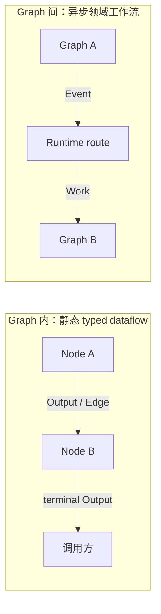
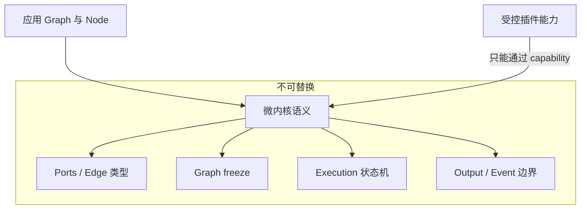

# 第一章：设计哲学与心智模型

本章先回答两个问题：Bricks 试图解决什么，以及为什么它选择现在这组概念。理解这两个问题后，后续 API 会更容易
记忆，因为它们都从同一套边界推导出来。

## 一句话定义

Bricks 是一个 typed graph runtime：一张 Graph 描述一次局部计算，多张 Graph 通过领域 Event 连接成工作流。

核心设计原则是：

> 内核语义固定，非本质能力可插拔；局部计算用 Graph，跨图协作用 Event。

## 为什么要区分两种流动

数据在同一张 Graph 内流动时，连接关系是静态的，类型可以提前校验，执行过程也可以从图结构推导。这里使用
`Output` 和 `Edge`。

跨 Graph 协作表达的是领域事实，例如“订单已创建”或“页面已抓取”。它可能启动零个、一个或多个后续工作，部署
位置和执行时间也不属于源 Graph。这里使用 `Event`。

两条通路不会隐式转换：

- Node 返回的 Output 不会自动发布成 Event；
- Event payload 不会自动进入某条 Edge；
- Graph 不直接引用或调用另一张 Graph；
- 目标 Graph 不在源 Node 的 `emit()` 调用栈中执行。

这个边界让单张 Graph 保持可推理，也让跨 Graph 工作流可以独立扩展和部署。

## 四层心智模型

| 层次 | 核心对象 | 回答的问题 |
| --- | --- | --- |
| 业务计算 | `Ports`、`Node`、`Output`、`Edge`、`Graph` | 数据怎样经过一组确定的步骤？ |
| 跨图协作 | `Event`、`Context.emit()`、`Runtime.on()` | 一个领域事实应启动哪些独立工作？ |
| 执行控制 | `Execution`、`Slot`、`SlotPool` | 工作如何等待、取消、限时和共享链路状态？ |
| 系统装配 | `PluginHost`、capability、contribution | 基础设施和非本质策略如何替换？ |

普通应用通常只使用前三层。插件和能力协议属于高级扩展接口，不进入顶层 `bricks` 词汇。

## 微内核：哪些东西不能被插件改变

以下语义共同定义了“什么是 Bricks Graph”，因此属于微内核：

- Ports 的类型约束；
- Graph 的冻结、可达性和 Edge 校验；
- InputPolicy 的 token 消费规则；
- Output 的局部传播；
- Event 与 Graph 数据流的边界；
- Execution 的状态、步数、超时、取消和错误语义。

如果插件可以改写这些规则，同一张 Graph 在不同环境中就可能具有不同含义，静态校验也会失去价值。

## 可插拔能力：哪些东西允许变化

部署环境和横切能力变化频繁，适合通过窄协议或受控 contribution 扩展：

- EventBus 与任务传输；
- GraphExecutor；
- InputSelector；
- Node Hook；
- Runtime Observer；
- 领域 Node 和状态适配器。

默认内存实现也由 `LocalRuntimePlugin` 通过 `PluginHost` 安装，与应用插件走同一套依赖、能力注册和生命周期路径。
插件只能贡献明确能力，不能访问 Runtime 私有状态或改写微内核规则。

## Less is more

顶层 API 只保留建立和运行工作流所需的对象。Work、Delivery、Router、Worker、Backend 和 PluginHost 虽然在实现中
存在，但普通用户不需要逐项组装。

这条原则也决定了框架的失败方式：错误配置应尽早、明确地失败，而不是通过隐式转换、默认重试或兼容分支猜测
调用方意图。

## 可靠性边界

默认实现是单进程内存运行时，不宣称持久化、broker ack、跨进程恢复、定时调度、死信队列或 exactly-once。
事件被接受后不会因为源 Graph 随后失败而撤回。外部副作用的幂等、领域去重和业务重试应由领域 Graph、Store 或
明确声明这些语义的后端实现。

## 接下来怎么读

下一章会运行第一张 Graph。之后分别深入 Graph 内的数据流和 Graph 间的事件流，再讨论 Execution、内部架构与
插件开发。

[下一章：第一张 Graph](02-first-graph.md)
