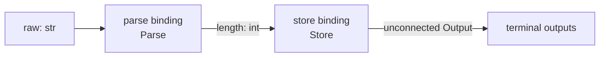
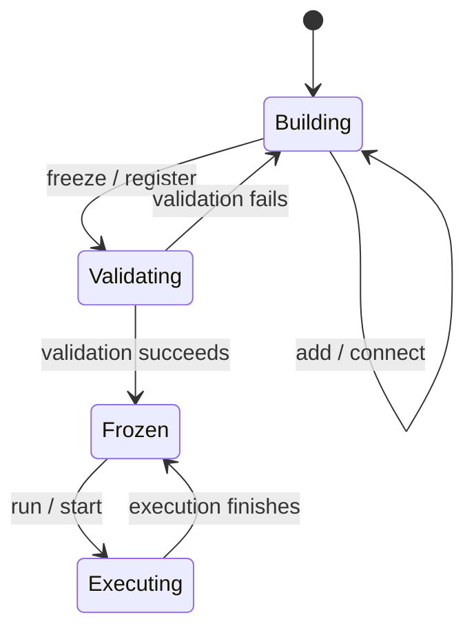
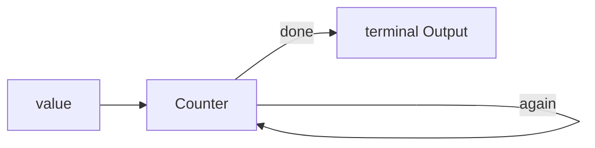

# 第三章：Graph 数据流

本章只讨论一张 Graph 内的值流动：Node 如何声明端口、Output 如何沿 Edge 传播，以及执行器何时触发下游 Node。

| 范围 | 使用的对象 | 用途 |
| --- | --- | --- |
| 单张 Graph | `Output`、`Edge` | 把一个 Node 的值交给下游 Node |
| 单次执行 | `Execution`、`ExecutionLimits` | 查询状态、控制步数/时长并协作式取消 |

## Ports 与 Node

`Ports` 是一个不可变的端口名到 Python class 的映射。端口类型必须是普通 Python class；连接时，源类型必须
是目标类型的子类。例如 `str` 可以连接到 `object` 输入，反过来不行。

```python
class Parse(Node):
    input_ports = Ports(raw=str)
    output_ports = Ports(length=int)
    timeout = 5

    def execute(self, inputs, context):
        del context
        return Output(len(inputs["raw"]), port="length")
```

`execute(inputs, context)` 的 `inputs` 是只读 Mapping。返回值只能是：

- 单个 `Output(value, port="...")`；
- 一个只包含 `Output` 的 iterable；
- `None`。

输出的端口必须声明在 `output_ports` 中，值也必须满足声明类型。未连接到 Edge 的合法输出会成为本次
`Runtime.run()` 的终端输出。

同步工作继承 `Node`；需要 await 的工作继承 `AsyncNode` 并把 `execute` 写为 `async def`。`timeout` 是单次
Node firing 的可选秒数限制，默认 `None` 表示不限时。冻结时会校验继承类别、方法风格和 timeout，并固定这些
执行元数据。

## Graph 与 Edge

Graph 在构建阶段可变，`freeze()` 后成为可执行的静态定义：

```python
graph = (
    Graph(entrypoint="parse")
    .add(parse=Parse(), store=Store())
    .connect("parse", "store", source_port="length", target_port="length")
    .freeze()
)
```

Graph 保存的是 Node binding 和端口之间的连接，而不是把 Node 本身变成全局实体：



`add()` 的关键字名称就是当前 Graph 内的 Node ID。需要动态生成 ID 时也可使用
`add(node_id, node)`；ID 属于 Graph binding，不是 Node 自身属性，因此同一个无状态 Node 行为可以用不同 ID
复用。

冻结会拒绝以下定义：空图或未知入口、重复节点/边、未知端口、端口类型不兼容、不可从入口到达的节点、`ALL`
Node 的必需端口没有任何入边，以及不合法的输入策略。`Runtime.register()` 会自动冻结尚未冻结的 Graph。



Graph 是普通有向图，Edge 可以回到上游或形成自环。循环不需要特殊 Edge；Node 通过是否继续产生连接到回路的
Output 决定循环是否继续：

```python
class Counter(Node):
    input_ports = Ports(value=int)
    output_ports = Ports(again=int, done=int)

    def execute(self, inputs, context):
        value = inputs["value"]
        if value < 3:
            return Output(value + 1, "again")
        return Output(value, "done")


graph = (
    Graph(entrypoint="counter")
    .add(counter=Counter())
    .connect("counter", "counter", source_port="again", target_port="value")
)
```



执行器默认不会截断循环：execution 的 `max_steps=0` 和 Graph `timeout=None` 表示无限制，每个 Node 的
`timeout=None` 也表示单次 firing 不限时。调用方可在 `run()`、`arun()`、`start()`、`iter()`、`aiter()` 或事件 route 上设置整图限制，
Node 时限则由各 Node 分别声明。只要回路继续产生可消费的数据，本次 execution 就继续运行；所有可执行 Node 和
端口队列都清空后，Graph 才自然结束。

### ExecutionPlan：从完整 Graph 选择子路径

同一张完整 Graph 可以为不同需求创建不同的严格执行计划：

```python
fast = graph.plan(include={"load", "parse", "save"})
full = graph.plan(include={"load", "parse", "enrich", "save"})

runtime.run("document.graph", payload, plan=fast)
```

`plan()` 会在需要时先冻结 Graph。计划只保留两端都被选择的原有 Edge，不会跨过未选择 Node 自动补边；入口不在
计划内、所选 Node 不可达，或 `ALL` Node 缺少输入端口时，创建计划会立即失败。计划绑定创建它的 Graph 实例，
创建后不可变，可以安全复用，也可以在并发 execution 中使用不同计划。没有传 `plan` 时仍执行完整 Graph。

## 输入触发策略

每个 Node 固定使用一种 `InputPolicy`：

| 策略 | 何时执行 | 本次 `inputs` |
| --- | --- | --- |
| `ALL`（默认） | 每个声明端口各有一个值 | 包含所有端口 |
| `ANY` | 按端口声明顺序找到第一个有值的端口 | 只包含被消费的一个端口 |
| `ON_START` | Graph 执行开始时 | 空 Mapping |

`ON_START` 只能用于零输入入口 Node。执行器为每个端口维护 FIFO 队列，并用 FIFO 就绪队列调度 Node；每次
调度只消费一组输入，再把仍然就绪的 Node 放到队尾，因此持续循环不会独占其他已就绪分支。如果 Graph 静止后
还剩无法组合的值，例如 `ALL` Node 只收到一半输入，会抛出 `IncompleteInputsError`。

[上一章：第一张 Graph](02-first-graph.md) · [下一章：Event 与跨图工作流](04-events-and-workflows.md)
