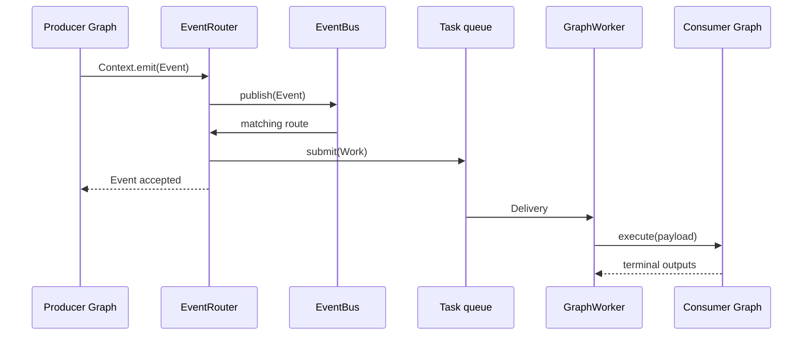
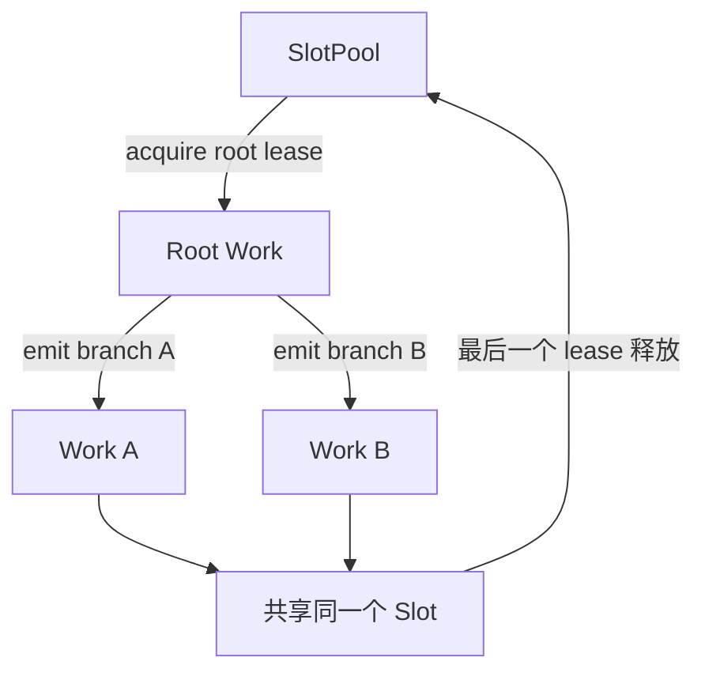

# 第四章：Event 与跨图工作流

前一章只讨论一张 Graph 内的局部数据流。本章引入第二条通路：Graph 通过 Event 发布领域事实，Runtime 将事实路由
为另一张 Graph 的独立 execution。

## Event 是最小领域事实

`Event(type, payload)` 只包含事件类型和领域 payload。内核不会自动添加时间、来源、关联 ID、幂等键或 tracing
字段；需要时应把它们放入领域 payload，或交给 Runtime Observer。

Node 使用 `Context.emit()` 发布事件：

```python
class Publish(Node):
    input_ports = Ports(message=str)
    output_ports = Ports()

    def execute(self, inputs, context):
        context.emit("message.created", inputs["message"])
```

应用也可以调用 `runtime.emit("message.created", payload)`。两种入口产生相同的 Event 语义。

## 从 Event 到另一张 Graph

下面的消费 Graph 与发布 Graph 没有直接引用关系：

```python
class Collect(Node):
    input_ports = Ports(message=str)
    output_ports = Ports()

    def __init__(self, received):
        self.received = received

    def execute(self, inputs, context):
        del context
        self.received.append(inputs["message"])


producer = Graph(entrypoint="publish").add(publish=Publish())
consumer = Graph(entrypoint="collect").add(collect=Collect(received))

with Runtime() as runtime:
    runtime.register("producer", producer)
    runtime.register("consumer", consumer)
    runtime.on(
        "message.created",
        graph="consumer",
        queue="messages",
        concurrency=2,
    )
    runtime.run("producer", "hello")
    runtime.wait_idle()
```

完整路径是：



`emit()` 成功返回表示 EventBus 已接受事件，不表示下游 Graph 已经完成。`wait_idle()` 会等待当前 Runtime 能观察到的
事件与 Work 级联静止。

## on、route、consume 与 observe

`on()` 是本地部署的便利组合：它先为命名 queue 准备 Consumer，再注册 Event route。

```python
runtime.on("message.created", graph="consumer", queue="messages", concurrency=2)
```

Router 与 Worker 分开部署时，可以分别配置：

```python
runtime.route("message.created", graph="consumer", queue="messages")
runtime.consume("messages", concurrency=2)
```

`observe()` 只是同步观察 Event，不创建 Work，也不执行 Graph：

```python
runtime.observe("message.created", audit)
runtime.observe("*", trace_all_events)
```

同一事件类型可以同时拥有多个观察者和路由。

## 提交与失败边界

事件一旦被 EventBus 接受就是渐进提交。源 Node 随后失败不会撤销已经发布的事件，下游 Work 也不会回到源 Graph
的事务中。默认实现不自动执行领域重试或 payload 去重。

同步观察者或事件传输失败会在发布点表现为 `EventDispatchError`。队列中的下游 Graph 是独立 execution，它的失败
由 `wait_idle()` 报告。

## Slot 如何跨 Graph 延续

队列执行时，`Context.slot` 表示当前进程内逻辑执行链的状态槽。Node 发布下游事件时，同一个 Slot 会随本地 Work
传递；多个分支可以共享它，但同一个 Slot 的 Graph execution 不会并发运行。所有本地分支结束后 Slot 才归还
SlotPool。



```python
proxy = context.slot.get("proxy")
if proxy is None:
    proxy = proxy_pool.acquire()
    context.slot["proxy"] = proxy
```

Slot 适合保存代理、Cookie、连接或链路缓存。领域持久状态仍应放在外部 Store。Slot、SlotPool 和内部 lease 不可
跨进程序列化；Work 穿过消息边界后由接收进程开始新的本地 Slot 链。直接调用 `run()`、`start()`、`iter()` 或
`aiter()` 不经过任务队列，因此 `context.slot` 为 `None`。

## Context 的边界

Context 不提供数据库、HTTP client、Runtime 或队列。外部依赖通过 Node 构造器注入。扩展 Node 可以使用：

- `state(namespace)`：保存当前 execution、当前 Node binding 内的临时状态；
- `on_quiescence(callback)`：注册 Graph 静止阶段的校验或清理；
- `checkpoint()`：让同步 Node 协作式响应取消和 timeout。

这些接口都不会把领域基础设施变成隐式全局依赖。

[上一章：Graph 数据流](03-graph-dataflow.md) · [下一章：Execution、并发与失败](05-execution.md)
