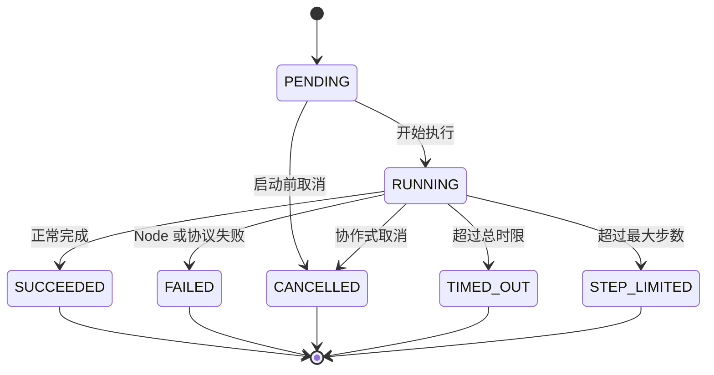
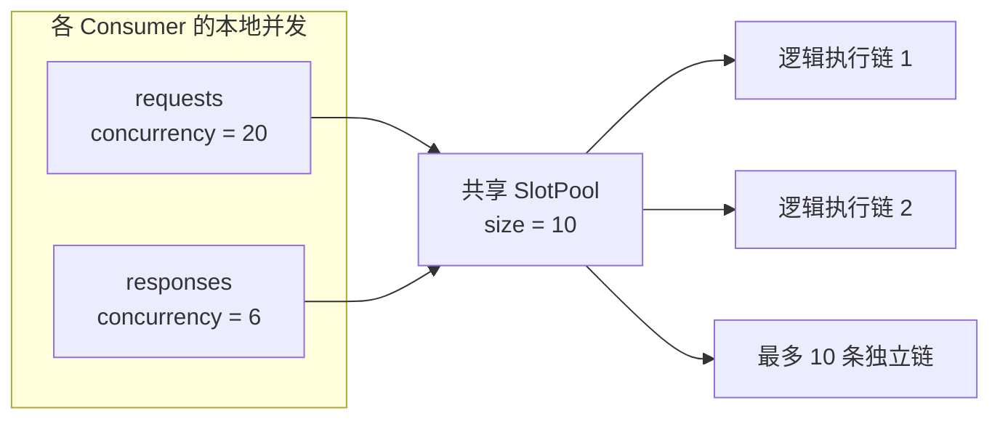

# 第五章：Execution、并发与失败

前两章分别解释了 Graph 数据流和 Event 工作流。本章把视角放在一次 execution 上，说明同步边界、输出流、并发、
取消、失败和关闭语义。

## 注册与直接执行

```python
with Runtime() as runtime:
    runtime.register("parse.graph", graph)
    outputs = runtime.run("parse.graph", "payload")
```

注册名在同一个 Runtime 内唯一。Graph 会在注册时冻结。入口有一个端口时，`run()` 的第二个参数整体作为该端口
的值；即使它是 Mapping 也不会被拆开。入口有多个端口时，必须传入端口名完全匹配的 Mapping。零输入入口只
接受 `None` 或 `{}`。

`Execution` 同时支持同步和异步等待。异步代码推荐启动后直接 await：

```python
execution = runtime.start("parse.graph", payload)
outputs = await execution
```

取消等待该 Execution 的 asyncio Task 时，会协作式取消底层 execution。`Runtime.arun()` 保留为等价便利接口，内部也是
`await runtime.start(...)`，所有入口共享同一条执行路径。

## Terminal Output 流

除最终 `tuple[Output, ...]` 外，调用方可以按产生顺序消费所有没有下游 Edge 的 Output：

```python
for output in runtime.iter("crawl.graph", payload):
    consume(output)

async for output in runtime.aiter("crawl.graph", payload):
    await consume(output)
```

也可以直接迭代 Execution：

```python
execution = runtime.start("crawl.graph", payload, output_buffer=64)
for output in execution:
    consume(output)

all_outputs = execution.result()
```

Execution 保留完整 terminal Output，因此迭代可以重放，`result()` 仍返回完整 tuple。活跃迭代器存在时，生产者与每个
消费者之间最多保留 `output_buffer` 个未读 Output；没有流消费者时不会为了背压阻塞 `result()`。若 Graph 在发布部分
Output 后失败，已发布 Output 不撤回，迭代器在读完它们后抛出执行异常。停止迭代不会隐式取消 Graph，需要调用
`execution.cancel()` 显式取消。

## 执行控制

`run()`、`arun()`、`start()`、`iter()` 和 `aiter()` 接受相同的整图控制参数：

```python
outputs = runtime.run(
    "crawl.graph",
    payload,
    max_steps=1000,
    timeout=60,
)
```

- `max_steps=0` 表示不限步数；正整数限制 Node firing 次数。Node 每消费一组输入并开始调用一次，计为一步。
- `timeout=None` 表示 Graph 总执行时长不限；正数表示秒数。

单次 Node firing 的时限是 Node 自身的配置：

```python
class Fetch(AsyncNode):
    timeout = 10

    async def execute(self, inputs, context):
        ...
```

`Node.timeout=None` 是默认值，表示该 Node 不限时；有限正数表示秒数。一次 firing 的 Hook 与 Node 调用共用这段
预算。Graph 冻结时会校验并固定该配置，不存在 Runtime 级的统一 Node timeout。

以上默认值保持无限制。超过限制分别抛出 `StepLimitExceededError`、`ExecutionTimeoutError` 或
`NodeTimeoutError`。限制不会撤回已经发布的 Event。

需要身份、状态、查询或取消时使用 `start()`：

```python
execution = runtime.start("crawl.graph", payload, timeout=60)
execution.cancel()
outputs = execution.result()

same = runtime.get_execution(execution.id)
```

`Execution` 记录 `id`、`status`、`steps`、当前 Node、起止时间、输出和异常。`cancel()` 是协作式取消：异步
Node 的 await 会被及时中断；同步 Node 可在长循环中调用 `context.checkpoint()`。无法安全强杀的普通同步函数会
在返回后检查 deadline，因此超过 timeout 后产生的外部副作用不会被自动撤销。



## Slot 与逻辑并发

不传 `slots` 时，`consume()` 自动创建一个大小等于 `concurrency` 的池；显式传入同一个池即可让多个 Consumer
共享逻辑执行槽：

```python
from bricks import SlotPool

slots = SlotPool(size=10)
runtime.consume("requests", concurrency=20, slots=slots)
runtime.consume("responses", concurrency=6, slots=slots)
```

`concurrency` 是某个 Consumer 最多同时执行的 Graph 数，`slots.size` 是同一进程内共享池最多同时承载的逻辑执行链
数，两者不要求相等。没有 Slot 的根 Work 会等待，不占用线程池 Worker；携带 Slot 的下游 Work 优先继续执行。
一个 Work 发出多个事件时，各分支共享同一个 Slot，并在全部结束后自动归还。



Slot 与 Work 链绑定而不是与线程绑定。在同一进程内，它可由一个 Consumer 的 Worker 交给另一个 Consumer 的任意
Worker，`Context.slot` 中的状态保持不变。进程或消息边界会结束这条 Slot 链，接收进程重新分配本地 Slot。显式
SlotPool 的生命周期由创建者管理；自动池由 GraphWorker 关闭。

`wait_idle(timeout)` 会交替等待事件总线和任务后端，直到由事件继续产生的工作也已完成。传 `0` 可以进行即时
空闲检查。

## 失败传播

| 发生位置 | 调用方看到的结果 |
| --- | --- |
| Graph 定义错误 | `GraphValidationError`（在 `freeze()` / `register()` 时） |
| Node 抛异常 | `ExecutionError`，带有 `graph` 和 `node` 信息 |
| 取消 execution | `ExecutionCancelledError` |
| Graph 或 Node 超时 | `ExecutionTimeoutError` / `NodeTimeoutError` |
| 超过最大步数 | `StepLimitExceededError` |
| 输入或输出类型不匹配 | `PortValueTypeError` |
| Node 返回非法值或端口 | `InvalidOutputError` |
| 半组输入遗留 | `IncompleteInputsError` |
| 同步观察者或事件传输失败 | 发布点抛出 `EventDispatchError` |
| 队列中异步 Graph 失败 | 下一次 `wait_idle()` 抛出该失败 |

默认事件总线即使一个观察者失败，也会继续调用同一事件的其余观察者，然后报告第一个失败。异步任务没有自动
重试；一次 `wait_idle()` 已报告的队列失败会被消费，不会在下一次等待时重复报告。

## 生命周期

推荐使用上下文管理器。`close()` 会先等待已接受的事件与任务完成，再按装配所有权停止插件和运行组件。具体关闭
顺序属于内部架构，本章只保证两个用户可观察行为：已接受工作会先排空，关闭后注册、运行或发布会抛出
`RuntimeClosedError`。

默认实现仅在进程内有效：Slot 不跨进程延续，也没有持久化、事务、broker ack、跨进程恢复、定时调度、死信队列、
背压或 exactly-once 保证。不要把 `wait_idle()` 理解为跨进程消息确认。

[上一章：Event 与跨图工作流](04-events-and-workflows.md) · [下一章：Runtime 内部架构](06-runtime-architecture.md)
