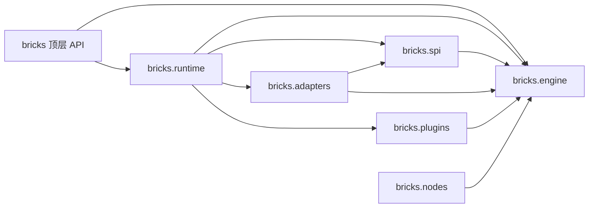
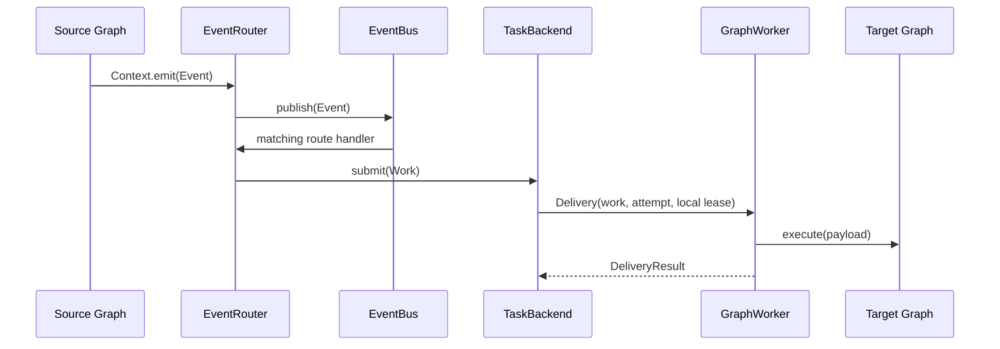
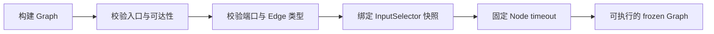

# 第六章：Runtime 内部架构

前五章描述用户可观察的行为。本章转向实现内部：Runtime 如何通过插件装配角色，一次直接执行和一次事件执行分别
经过哪些组件，以及各层为什么保持独立。

## 分层总览

| 层次 | 源码边界 | 对象 | 责任 |
| --- | --- | --- | --- |
| 用户模型 | `bricks.engine`，由 `bricks` 导出 | Ports、Node、Output、Edge、Graph、Event、Context、Execution、Slot | 描述业务计算与可观察执行状态 |
| 用户门面 | `bricks.runtime`，由 `bricks` 导出 | Runtime | 注册 Graph，代理执行、事件、观察和控制入口 |
| 装配宿主 | `bricks.plugins`、`bricks.runtime.plugin` | PluginHost、LocalRuntimePlugin | 解析插件依赖，注册 capability，管理统一生命周期 |
| 运行角色 | `bricks.runtime` | EventRouter、GraphWorker | 分别处理 Event -> Work 与 Work -> Graph execution |
| 能力端口 | `bricks.spi` | RouterRole、WorkerRole、EventBus、任务传输、GraphExecutor、SlotProvider、执行资源协议 | 隔离编排、传输、执行和资源实现 |
| 默认适配器 | `bricks.adapters.memory`、`bricks.engine.executor` | EventBus、TaskBackend、Engine | 提供单进程内存运行时 |

Runtime 是面向应用的稳定门面，PluginHost 是系统装配根。普通应用不需要看到后四层。

## 源码目录与包职责

源码目录按照架构层次组织，而不是把所有运行时职责都放入 `engine`：

```text
bricks/
├── __init__.py              # 宪法规定的顶层公共 API
├── engine/                  # Graph 执行微内核及受控内核扩展点
│   ├── core.py              # Ports、Node、AsyncNode、Output、InputPolicy
│   ├── graph.py             # Edge、Graph、ExecutionPlan 与冻结校验
│   ├── execution.py         # Execution 句柄、限制与状态
│   ├── execution_resources.py # 输出存储与等待通知协议及默认实现
│   ├── executor.py          # 单张冻结 Graph 的默认执行器 Engine
│   ├── events.py            # Event 与 Context
│   ├── slots.py             # Slot 与 SlotPool
│   ├── hooks.py             # Node Hook 契约和快照注册
│   ├── policies.py          # selector 契约、引用与冻结绑定
│   ├── observation.py       # 只读 Runtime 观察模型
│   ├── errors.py            # 内核和运行控制错误
│   └── runner.py            # 同步/异步 Node 调用桥接
├── runtime/                 # Runtime 门面和运行角色
│   ├── facade.py            # Runtime
│   ├── router.py            # EventRouter
│   ├── worker.py            # GraphWorker
│   ├── plugin.py            # LocalRuntimePlugin
│   └── _utils.py            # 私有生命周期辅助函数
├── plugins/                 # PluginHost、descriptor、capability 与 contribution
├── spi/                     # EventBus、任务传输、GraphExecutor 等窄协议
├── adapters/                # 随包提供的具体部署适配器
│   └── memory.py            # memory.EventBus、memory.TaskBackend
└── nodes/                   # 可复用的非内核 Node，例如 KeyedJoin
```

`bricks.engine` 不再充当高级 API 聚合入口。普通应用只从 `bricks` 导入；插件、SPI 和基础设施作者根据职责从
`bricks.runtime`、`bricks.plugins`、`bricks.spi`、`bricks.adapters`、`bricks.nodes` 或具体 `bricks.engine.*` 模块导入。
仓库不保留旧模块路径的兼容 re-export。

## 依赖方向

包依赖必须保持单向，Runtime 是组合这些层次的门面，而不是被内核反向调用：



这里的关键约束是：

- `engine` 不依赖 `runtime`、`plugins`、`spi`、`adapters` 或可复用 `nodes`；
- `spi` 只引用协议签名所需的 Graph、Event、Execution、Hook 和 Slot 模型；
- `adapters` 实现 SPI，可以引用搬运 Event/Work 所需的最小内核类型；
- `plugins` 管理装配元数据与生命周期，不读取 Runtime 私有状态；
- `runtime` 可以依赖前述各层并完成组合，但不得把部署算法重新实现到门面中；
- `nodes` 只放可复用的非内核 Node，只依赖内核公共语义，不能成为 Runtime 的隐式前置条件。

## 默认装配


`Runtime()` 根据已声明 capability 让 LocalRuntimePlugin 逐项补齐缺失的 EventBus、TaskBackend、GraphExecutor 和 ExecutionFactory，
再组装 Router 与 Worker。内建实现和应用插件使用相同的依赖解析、capability 注册、启动和停止流程。显式
`Runtime(router=..., worker=...)` 用于 Router/Worker 独立部署，此模式不创建 PluginHost。

## 直接执行路径

`run()`、`start()`、`iter()`、`aiter()` 和 `arun()` 最终共享同一条执行路径：


GraphWorker 管理注册表、Execution 句柄和直接执行线程；GraphExecutor 只负责执行一张已经冻结的 Graph。这个边界
允许替换执行器，而不把 Graph 注册、队列消费或事件路由混入执行算法。

Runtime 按 `RouterRole`、`WorkerRole` 接受结构化实现，具体的 EventRouter 与 GraphWorker 是默认角色实现。
ExecutionFactory 为直接执行和队列 Work 创建同一类句柄，可注入 OutputStore 与 ExecutionNotifier。宿主调用公开的
`execution.start(graph)`、`succeed()` 和 `fail(error)`；执行器调用 `step()`、`checkpoint()` 与输出交付接口，
不负责切换 execution 的最终状态。

GraphExecutor 同步执行后返回 None，也可以返回 Awaitable[None]。默认 GraphWorker 会等待异步执行及其取消清理
真正结束，仍占用该次 execution 的消费并发；需要其他调度方式时可替换 WorkerRole。两种执行器都通过统一输出接口
交付结果，Worker 不再根据最终返回值补发输出或强制读取完整 tuple。

## 事件执行路径



EventRouter 不需要目标 Graph 定义，只负责把匹配 Event 转成 Work。GraphWorker 不需要源 Event，只按 Work 中的
注册名寻找 Graph。两者可以位于不同进程，只要 EventBus 和任务传输实现对应部署语义；进程边界不会延续 Slot，
接收端 TaskConsumer 会为该 Work 开始新的本地 Slot 链。

## Graph 冻结边界

Runtime 注册 Graph 时，GraphWorker 使用当前 PolicyRegistry 绑定输入选择器并冻结 Graph：



冻结后，节点 binding、Edge、端口和输入策略不会变化。ExecutionPlan 只能选择原 Graph 中已有的节点与 Edge，不能
跨过未选择节点自动补边。

## Engine 调度循环

默认 Engine 为每个 Node input port 维护 FIFO token 队列，并用 FIFO ready queue 调度 Node：

1. 把入口输入放入 entrypoint 队列；
2. InputSelector 只根据端口和可用 token 数选择本次消费组合；
3. 在 `execution.step(node_id)` 内执行 Hook 和 Node；
4. 校验 Output 端口与类型；
5. 沿 Edge 投递下游，或发布为 terminal Output；
6. ready queue 清空后检查残留输入并运行 quiescence callback。

每轮只消费一组输入，避免持续循环饿死其他就绪分支。普通回边与其他 Edge 使用完全相同的投递规则。

## 快照与动态扩展

不同扩展点在不同边界固定快照：

| 扩展 | 固定时机 | 目的 |
| --- | --- | --- |
| InputSelector | Graph freeze | 同一张 Graph 的触发语义稳定 |
| Node Hook | execution start | 在途 execution 不受 attach/detach 影响 |
| Runtime Observer | 发布每个 RuntimeEvent 时读取 | 支持动态观察且不干预业务结果 |

Observer 异常会被隔离。Hook 可以转换输入、输出或流程，但最终结果仍受 Graph 端口和执行控制契约约束。

## Slot 租约与分支

Event 和 Work 都不携带 lease。同一进程内，TaskConsumer 为根 Work 从 SlotPool 获取 lease；本地 Router 与
TaskBackend 通过仅限进程内的发布上下文和 Delivery 为每个下游分支保留引用，交付完成后释放，最后一个分支结束时
Slot 回到池中。同一个 Slot 使用 execution lock 保证 Graph 不会并发修改链路状态。远程传输只序列化 Event/Work；
接收端反序列化后创建新的本地根 Delivery 和 Slot 链。

## 生命周期与所有权

插件模式下，Runtime 先 `wait_idle()`，再关闭 PluginHost。宿主逆序停止插件；LocalRuntimePlugin 依次关闭 Worker、
Router 和自己创建的底层组件。注入组件默认由调用方管理，`close_injected=True` 才转移所有权。

显式 Router/Worker 模式下，Runtime 直接关闭两个角色，各角色再按自己的所有权配置处理底层组件。

## 架构边界

以下约束防止内部职责泄漏为用户概念：

- Runtime 不实现消息持久化、队列算法或 Node 执行；
- Router 不注册或执行 Graph；
- Worker 不订阅源 Event；
- GraphExecutor 不管理队列与 Graph 注册表；
- 插件通过 capability 工作，不读取 Runtime 私有字段；
- Work、Delivery 和窄角色协议位于 `bricks.spi`，不进入顶层 `bricks` API；默认内存实现位于 `bricks.adapters`。

[上一章：Execution、并发与失败](05-execution.md) · [下一章：插件、SPI 与适配器开发](07-plugins.md)
