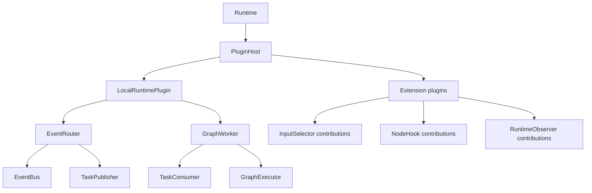
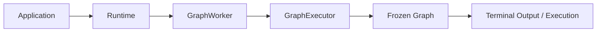
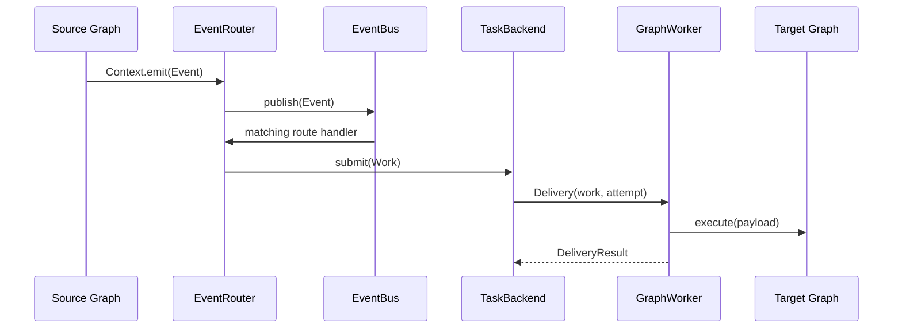
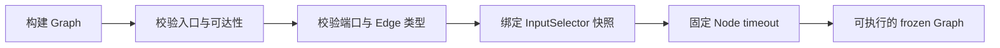

# 第六章：Runtime 内部架构

前五章描述用户可观察的行为。本章转向实现内部：Runtime 如何通过插件装配角色，一次直接执行和一次事件执行分别
经过哪些组件，以及各层为什么保持独立。

## 分层总览

| 层次 | 对象 | 责任 |
| --- | --- | --- |
| 用户模型 | Ports、Node、Output、Edge、Graph、Event、Context、Execution、Slot | 描述业务计算与可观察执行状态 |
| 用户门面 | Runtime | 注册 Graph，代理执行、事件、观察和控制入口 |
| 装配宿主 | PluginHost、LocalRuntimePlugin | 解析插件依赖，注册 capability，管理统一生命周期 |
| 运行角色 | EventRouter、GraphWorker | 分别处理 Event -> Work 与 Work -> Graph execution |
| 能力端口 | EventBus、TaskPublisher、TaskConsumer、GraphExecutor | 隔离传输、队列和执行实现 |
| 默认实现 | MemoryEventBus、MemoryTaskBackend、Engine | 提供单进程内存运行时 |

Runtime 是面向应用的稳定门面，PluginHost 是系统装配根。普通应用不需要看到后四层。

## 默认装配

`Runtime()` 自动补入 LocalRuntimePlugin。内建实现和应用插件使用相同的依赖解析、capability 注册、启动和停止
流程。显式 `Runtime(router=..., worker=...)` 用于 Router/Worker 独立部署，此模式不创建 PluginHost。

## 直接执行路径

`run()`、`start()`、`iter()`、`aiter()` 和 `arun()` 最终共享同一条执行路径：

GraphWorker 管理注册表、Execution 句柄和直接执行线程；GraphExecutor 只负责执行一张已经冻结的 Graph。这个边界
允许替换执行器，而不把 Graph 注册、队列消费或事件路由混入执行算法。

## 事件执行路径

EventRouter 不需要目标 Graph 定义，只负责把匹配 Event 转成 Work。GraphWorker 不需要源 Event，只按 Work 中的
注册名寻找 Graph。两者可以位于不同进程，只要 EventBus 和任务传输实现对应部署语义。

## Graph 冻结边界

Runtime 注册 Graph 时，GraphWorker 使用当前 PolicyRegistry 绑定输入选择器并冻结 Graph：

冻结后，节点 binding、Edge、端口和输入策略不会变化。ExecutionPlan 只能选择原 Graph 中已有的节点与 Edge，不能
跨过未选择节点自动补边。

## Engine 调度循环

默认 Engine 为每个 Node input port 维护 FIFO token 队列，并用 FIFO ready queue 调度 Node：

1. 把入口输入放入 entrypoint 队列；
2. InputSelector 只根据端口和可用 token 数选择本次消费组合；
3. 在 `execution.step(node_id)` 内执行 Hook 和 Node；
4. 校验 Output 端口与类型；
5. 沿 Edge 投递下游，或发布为 terminal Output；
6. ready queue 清空后检查残留输入并运行 quiescence callback。

每轮只消费一组输入，避免持续循环饿死其他就绪分支。普通回边与其他 Edge 使用完全相同的投递规则。

## 快照与动态扩展

不同扩展点在不同边界固定快照：

| 扩展 | 固定时机 | 目的 |
| --- | --- | --- |
| InputSelector | Graph freeze | 同一张 Graph 的触发语义稳定 |
| Node Hook | execution start | 在途 execution 不受 attach/detach 影响 |
| Runtime Observer | 发布每个 RuntimeEvent 时读取 | 支持动态观察且不干预业务结果 |

Observer 异常会被隔离。Hook 可以转换输入、输出或流程，但最终结果仍受 Graph 端口和执行控制契约约束。

## Slot 租约与分支

TaskConsumer 为根 Work 从 SlotPool 获取 lease。EventRouter 为每个下游分支保留引用，EventBus 和 TaskBackend 在
交付完成后释放自己的引用；最后一个分支结束时 Slot 回到池中。同一个 Slot 使用 execution lock 保证 Graph 不会
并发修改链路状态。

## 生命周期与所有权

插件模式下，Runtime 先 `wait_idle()`，再关闭 PluginHost。宿主逆序停止插件；LocalRuntimePlugin 依次关闭 Worker、
Router 和自己创建的底层组件。注入组件默认由调用方管理，`close_injected=True` 才转移所有权。

显式 Router/Worker 模式下，Runtime 直接关闭两个角色，各角色再按自己的所有权配置处理底层组件。

## 架构边界

以下约束防止内部职责泄漏为用户概念：

- Runtime 不实现消息持久化、队列算法或 Node 执行；
- Router 不注册或执行 Graph；
- Worker 不订阅源 Event；
- GraphExecutor 不管理队列与 Graph 注册表；
- 插件通过 capability 工作，不读取 Runtime 私有字段；
- Work、Delivery 和 Backend 位于高级 SPI，不进入顶层 `bricks` API。

[上一章：Execution、并发与失败](05-execution.md) · [下一章：插件与扩展开发](07-plugins.md)
