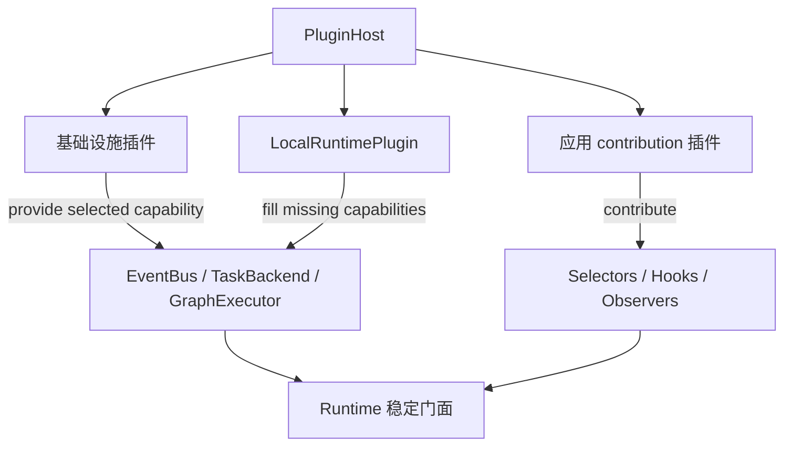
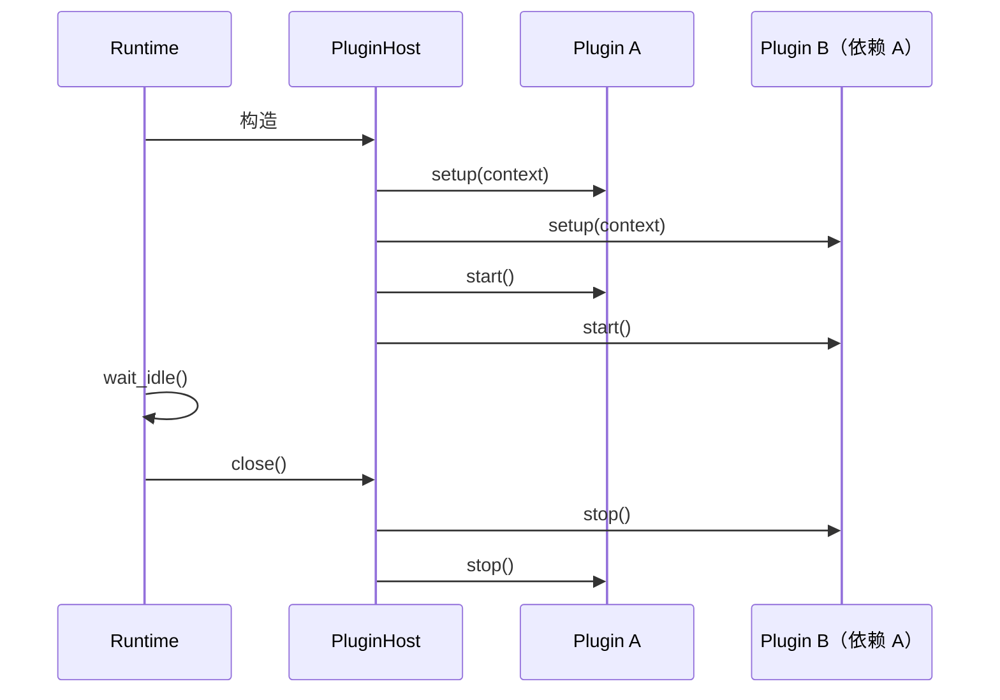
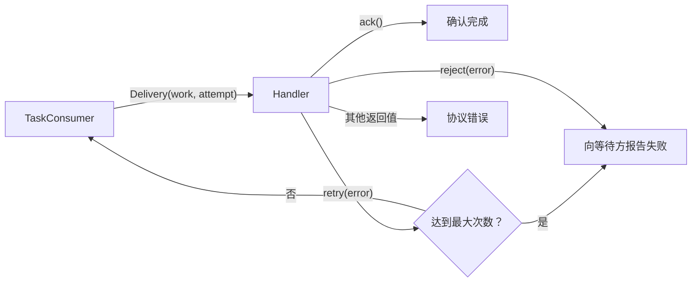

# 第七章：插件、SPI 与适配器开发

本章面向插件作者和基础设施适配器作者。开始前应先理解[Runtime 内部架构](06-runtime-architecture.md)中的角色与
能力端口；普通业务 Graph 不需要使用本章 API。

## 统一插件宿主

需要向 Runtime 注册 selector、Hook 或 Observer 时，优先声明 contribution 插件。插件通过 `PluginDescriptor`
声明身份、版本、依赖和 capability，并在 `setup()` 中
注册能力；全部插件 setup 完成后才依赖顺序调用 `start()`，关闭时逆序调用 `stop()`：

```python
from bricks import Runtime
from bricks.plugins import ContributionPlugin, NodeHookContribution

contributions = ContributionPlugin(
    "acme/crawl",
    selectors={"acme.crawl/ready": ready_selector},
    hooks={
        "acme.crawl/cache": NodeHookContribution(
            cache_hook,
            graph="crawl.graph",
            node="request",
        )
    },
    observers={"acme.crawl/tracing": trace_observer},
)

runtime = Runtime(plugins=(contributions,))
```

`Runtime()` 会检查插件声明的 capability，并通过 `LocalRuntimePlugin` 逐项补齐缺失的 EventBus、TaskBackend 和
GraphExecutor、ExecutionFactory，再组装标准 Router 与 Worker。因此默认内存组合也是普通内建插件，而不是 Runtime 的隐藏特例；只
提供一个基础设施 capability 的插件可以与其余默认实现组合。插件只从 `PluginContext` 取得已声明 capability，
不应读取 Runtime、Router 或 Worker 的私有字段。

`PluginDescriptor.provides` 声明单例 capability，只能有一个 provider；`contributes` 声明可聚合的 capability。
InputSelector、NodeHook 和 RuntimeObserver 都属于后者，`ContributionPlugin` 会自动填写对应声明。多个插件可以
向同一种 capability 贡献不同名称的实现，同名贡献会被拒绝。`provide()` 与 `contribute()` 必须分别兑现对应的声明，
同一 capability 不能同时作为单例和聚合能力。
插件 ID 和 contribution 名必须带命名空间。`PluginDescriptor.api_version` 声明所需的插件 SPI 主版本，当前为
`"1"`。`requires` 声明插件 ID 依赖，`requires_capabilities` 声明单例 capability 依赖；两者都参与拓扑排序。需要
依赖贡献插件的生命周期时使用 `requires`，读取聚合结果使用 `context.contributions()`。缺失或
循环依赖、API 不兼容、能力冲突或 descriptor 声明未兑现都会在 Runtime 构造期间失败。

`PluginHost` 当前只负责显式传入的可信 Python 插件，不会扫描环境或在 import 时自动执行第三方代码。需要配置驱动
发现时，应在应用 composition root 中完成包发现和白名单选择，再把实例交给 Runtime。



### 自定义基础设施

只替换部分基础设施时，插件声明自己提供的 capability，Runtime 会补齐其余默认实现：

```python
from bricks import Runtime
from bricks.plugins import CAP_EVENT_BUS, PluginDescriptor


class RedisEventsPlugin:
    descriptor = PluginDescriptor(
        "acme/redis-events",
        "1.0.0",
        provides=(CAP_EVENT_BUS,),
    )

    def __init__(self, events):
        self.events = events

    def setup(self, context):
        context.provide(CAP_EVENT_BUS, self.events)

    def start(self, context):
        del context

    def stop(self, context):
        del context


runtime = Runtime(plugins=(RedisEventsPlugin(my_event_bus),))
```

一次注入全部基础设施时，也可以直接配置内建装配插件：

```python
from bricks import Runtime
from bricks.runtime import LocalRuntimePlugin

local = LocalRuntimePlugin(
    events=my_event_bus,
    tasks=my_task_backend,  # 同时实现 TaskPublisher 与 TaskConsumer
    executor=my_graph_executor,
)
runtime = Runtime(plugins=(local,))
```

这些注入组件默认由调用方管理；只有确认组件为该插件独占时才传 `close_injected=True`。

Router 与 Worker 需要独立部署或不由同一个进程插件管理时，仍可显式组装：

```python
from bricks import Runtime
from bricks.runtime import EventRouter, GraphWorker

router = EventRouter(
    events=my_event_bus,
    publisher=my_task_publisher,
)
worker = GraphWorker(
    consumer=my_task_consumer,
    executor=my_graph_executor,
    emit=router.publish,
)
runtime = Runtime(router=router, worker=worker)
```

`EventRouter`、`GraphWorker` 和底层协议是高级组合接口，不属于顶层 `bricks` 公共 API。应用侧的 Graph、Node、
Event 和 Runtime 门面用法不需要因此改变。`Runtime()` 仍会经 LocalRuntimePlugin 创建完整的默认内存组合。

窄角色协议从 `bricks.spi` 导入，随包提供的本地实现从 `bricks.adapters` 导入：

```python
from bricks.adapters import memory
from bricks.spi import EventBus, GraphExecutor, TaskConsumer, TaskPublisher

events = memory.EventBus()
tasks = memory.TaskBackend()
```

`bricks.spi` 只定义角色和跨适配器数据模型；`bricks.adapters` 只放具体部署实现。`TaskBackend` 仅是
`TaskPublisher` 与 `TaskConsumer` 的便利组合，不代表 EventBus 或 GraphExecutor。

| 协议 | 负责什么 | 默认实现 |
| --- | --- | --- |
| `EventBus` | Event 订阅、发布、投递空闲与关闭 | `memory.EventBus` |
| `TaskPublisher` | 向命名队列提交 Work | `memory.TaskBackend` |
| `LocalTaskPublisher` | 可选：在当前进程延续 Slot lease | `memory.TaskBackend` |
| `SlotLease` | 引用管理、读取 Slot 和串行 execution | 由 `SlotPool` 返回 |
| `TaskConsumer` | 调度带 Slot 的 Work，并控制当前实例的本地并发 | `memory.TaskBackend` |
| `TaskBackend` | 同时实现发布与消费的组合协议 | `memory.TaskBackend` |
| `SlotProvider` | 申请资源、查询容量和可用通知 | `SlotPool` |
| `RouterRole` / `WorkerRole` | Runtime 所依赖的事件与执行角色 | EventRouter / GraphWorker |
| `GraphExecutor` | 执行已冻结 Graph，通过 Execution 交付终端 Output | `Engine` |
| `HookableGraphExecutor` | GraphExecutor 的可选动态 Hook 能力 | `Engine` |
| `ExecutionFactory` | 为每次直接执行和 Work 创建独立句柄及资源 | `Execution` 构造器 |
| `OutputStore` | 顺序追加、按索引重放终端输出 | MemoryOutputStore |
| `ExecutionNotifier` | 同步和异步等待的版本化唤醒 | LocalExecutionNotifier |

## 适配器的最低要求

EventBus 和 TaskConsumer 必须实现 `idle`、`wait_idle(timeout)` 和 `close()` 所表达的本实例生命周期语义；
TaskPublisher 的 `submit()` 正常返回即表示后端已接受 Work，同时提供 `close()` 释放发布端资源。GraphExecutor
提供 `execute()` 和 `close()`。角色依赖这些方法完成自身的等待与关闭。

- EventBus 的 `subscribe(event_type, handler, subscription=...)` 需要支持精确类型和 `"*"` 通配订阅。同名
    subscription 的多个实例竞争消费，不同 subscription 各自收到一份；省略 subscription 的观察者相互独立。
    Event 始终只有 `type` 和 `payload`，EventBus 不接触 Slot 或 lease。
- TaskPublisher 把 Work 提交到命名 queue，`submit()` 正常返回表示后端已经接受；同一进程内 TaskConsumer 的
    `bind(queue, handler, concurrency=..., slots=...)` 在调度根 Work 前通过 `slots.try_acquire()` 获取 lease。Work 只包含 Graph
    名、输入、领域 trigger、ID 和 limits；进程内 lease 只存在于 `Delivery.slot_lease`。支持 `LocalTaskPublisher` 的本地后端
    可以延续 lease；等待 Slot 的根 Work 不能占用 concurrency，交付完成或失败后必须释放 Delivery 持有的 lease。
- GraphExecutor 接收注册名、冻结 Graph、入口输入、Event emitter、可选 ExecutionPlan，以及可选 `slot=` 和必需的
  `execution=`。GraphWorker 会把冻结后的 Node timeout 快照绑定到 Execution 并开始执行；替换执行器必须为每次
  Node firing 使用 `with execution.step(node_id): ...` 包住完整调用，并在调度边界调用
  `execution.checkpoint()`，从而保留步数、取消和 timeout 语义。终端输出逐项调用 `execution.publish_output(output)`，
  异步执行器使用 `await execution.apublish_output(output)` 避免背压阻塞事件循环。同步执行返回 None，异步执行返回
  Awaitable[None]，不得返回结果 tuple；所有结果都来自同一输出存储。自定义执行器若还实现
  `HookableGraphExecutor` 的 `attach()`，`Runtime.attach()` 会按结构化能力委托给它。

可参考 [test_runtime_spi.py](../tests/engine/test_runtime_spi.py) 中的同步替身：它验证三个能力可独立替换，也验证
Runtime 不依赖默认内存实现的私有字段。

## 核心实现的替换

`RouterRole`、`WorkerRole` 是结构化协议，替换角色无需继承 EventRouter 或 GraphWorker。显式装配时仍需提供完整
角色组合；可以只替换其中一个角色的实现，另一个使用默认类。插件装配时使用 `CAP_EVENT_ROUTER` 和
`CAP_GRAPH_WORKER` 提供角色。自定义角色插件负责通过公开角色接口安装自己的贡献并管理关闭顺序。

WorkerRole 的基本执行入口是 `start()`，同步 `Runtime.run()` 和异步 `Runtime.arun()` 分别等待它返回的同一个
Execution。`iter()`、`aiter()` 必须先建立输出订阅再启动执行，保证首批输出也受到背压约束。替换 Worker 仍须在注册时
冻结 Graph、验证 ExecutionPlan，保持 Work 并发、Slot 链、错误传播和等待关闭的契约。

替换执行器可以通过 `graph.spec_for(node_id)` 读取冻结后的端口、输入策略和 timeout，通过 `graph.outgoing_for()`
读取原图连接；ExecutionPlan 的 `graph` 和 `outgoing_for()` 描述计划所属图及计划内的连接，不需要读取私有字段。
执行宿主调用 `execution.start(graph)` 开始计时，执行器正常完成后调用 `succeed()`，异常时调用 `fail(error)`。
`start()` 返回 False 表示句柄已在启动前取消，宿主不得继续执行。取消和 timeout 的解释仍由 Execution 统一负责。

`ExecutionFactory` 可以通过 LocalRuntimePlugin 的 `execution_factory=` 注入，也可以通过
`CAP_EXECUTION_FACTORY` capability 提供。其签名为：

```python
def make_execution(graph, *, limits, id=None, output_buffer=64):
    return Execution(
        graph,
        limits=limits,
        id=id,
        output_buffer=output_buffer,
        output_store=make_output_store(),
        notifier=make_notifier(),
    )
```

`make_output_store()` 和 `make_notifier()` 由应用实现；每次调用必须创建独立资源。工厂必须保留收到的 Graph 名、
Work ID、limits、output_buffer，并返回 PENDING 状态的 Execution。默认工厂也是经 LocalRuntimePlugin 装配的
普通 capability，没有为内存实现单独设置创建路径。

OutputStore 提供 `append(output)`、`len(store)` 和 `store[index]`。存储在绑定时必须为空，追加必须原子完成，已接受
输出必须保持顺序且可重复读取；不能通过丢弃旧输出来悄悄改变重放契约。存储资源的生命周期由提供工厂的应用或插件
管理，必须至少覆盖 Execution 的读取期。框架只在调用方请求完整结果时读取全量数据。

ExecutionNotifier 提供单调版本 `version`、`notify()`、`wait(version, timeout)` 和 `wait_async(version)`。
通知递增版本并唤醒全部等待者；等待旧版本应立即完成，等待当前版本必须允许后续跨线程通知唤醒。取消异步等待时
必须移除对应等待者，不能影响其他消费者。同步与异步输出接口在该通知机制上共享背压、取消和 timeout 规则。

[执行资源替换测试](../tests/engine/test_execution_extensions.py) 验证同步/异步第三方执行器、SQLite 输出存储和通知
注入；[角色与资源池替换测试](../tests/engine/test_role_extensions.py) 验证不继承默认类的角色组合及独立 SlotProvider。

## Slot 的公开资源接口

适配器从 `bricks.spi` 导入 `SlotProvider` 和 `SlotLease` 协议。默认 SlotPool 和第三方资源池经过相同的结构化检查，
适配器通过协议获取 lease，不构造内部 lease、不读取内部锁。

| 接口 | 契约 |
| --- | --- |
| `slots.try_acquire()` | 立即申请一个根执行链引用，池耗尽时返回 `None` |
| `slots.acquire(timeout=None)` | 在调度控制线程中等待；超时抛 `TimeoutError`，零秒表示不等待 |
| `slots.subscribe_available(callback)` | 订阅 Slot 归还通知，返回幂等取消函数；通知不预留资源 |
| `lease.slot` | 读取执行链的 Slot，不转移引用所有权 |
| `lease.retain()` / `lease.release()` | 增加和释放引用；最后一个引用释放后归还 Slot |
| `lease.execution()` | 上下文管理器，串行执行同一 Slot 的 Graph，并在执行期间自动保留一个临时引用 |

根 Work 在分配到 lease 后才可占用 Consumer 的执行线程；没有可用 Slot 时保留在待调度队列中，并继续调度已经
携带 lease 的延续 Work。先注册可用通知，再尝试调度；通知只提示重新调用 `try_acquire()`，其他 Consumer 可能先取得
资源。回调应快速返回，抛出的普通异常会被记录并隔离，不影响归还和其他订阅者。关闭 Consumer 时取消自己的订阅。

取得引用后，交付和释放遵循下面的所有权规则：

```python
from bricks.spi import Delivery

lease = slots.try_acquire()
if lease is not None:
    try:
        result = handler(Delivery(work, slot_lease=lease))
    finally:
        lease.release()
```

该片段表示已分配资源的交付边界；实际适配器仍须把 handler 调用调度到配置的执行线程，并处理 `DeliveryResult`。
GraphWorker 通过 `with lease.execution() as slot:` 包住完整 Graph execution；退出执行上下文只释放临时引用，
交付所持引用仍由 Consumer 在 `finally` 中释放。提交执行线程失败时，同样必须释放尚未交付的引用。
默认内存后端在 Work 入队后即接管引用；随后提交执行线程失败会释放该引用，并通过 `wait_idle()` 报告失败，
不会再让发布方误以为接管失败而重复释放。

每个分支、重投递或异步交接都必须有自己的引用。`LocalTaskPublisher.submit_local(queue, work, lease)` 正常返回时
接管调用方转交的一个引用，抛错时引用仍由调用方释放；接收方不能再次为同一交接重复 retain。Router 已为每个本地
分支 retain，Consumer 处理完该次交付后 release。lease 全部释放后，读取、retain、release 或再次进入 execution
都会被拒绝。池关闭后不接受申请和新订阅，并唤醒正在等待的申请；已持有的引用仍能执行和归还。

`SlotLease` 只属于当前进程，不参与 broker 租约或远程确认。远程适配器仅序列化 `Work`，接收进程从自己的 SlotPool
申请 lease，再创建 `Delivery(work, slot_lease=lease)`。不要序列化 Slot、SlotPool 或带 lease 的 Delivery。

[独立适配器契约测试](../tests/engine/test_slot_adapter.py) 展示了仅通过上述公开接口实现跨队列延续、分支引用和失败
归还；[Slot 契约测试](../tests/engine/test_slots.py) 验证池耗尽、关闭唤醒、执行互斥及错误释放。

## 语义必须由适配器声明

协议刻意没有规定序列化、持久化、确认或重试策略。因此 Redis、RabbitMQ、数据库任务表等适配器必须在自己的
文档中明确：

- 事件和 Work 的投递语义（至多一次、至少一次等）；
- 哪一方确认消息、何时重试、失败放到哪里；
- `wait_idle()` 在分布式场景下具体表示什么；
- `close()` 是停止接收、排空本地任务，还是等待远程 broker 完成；
- payload 的序列化限制，以及幂等性由谁保证。
- `Work.limits` 与 execution ID 如何跨进程传递，取消请求如何送达执行进程。

不要仅因适配器名为 Redis 或 MQ 就暗示这些能力已经存在。领域 ID、去重和外部副作用的幂等性仍应由领域模型
显式实现。

`Event` 和 `Work` 本身就是不含 lease 的传输模型。远程适配器必须序列化 Graph 名、输入、Work ID、limits 和领域
Event，并明确 payload 的编码限制；接收端 TaskConsumer 把反序列化后的 Work 作为新的本地根 Work，从本地
SlotPool 获取 Slot，再创建本地 Delivery。跨进程适配器不得序列化 Delivery 的 lease，也不得宣称延续了源进程的
Slot。

## 分离 Router 与 Worker

`route()` 只负责把 Event 转成 Work 并投递到 queue，`consume()` 只负责消费 queue 并执行 Work 指定的 Graph：

```python
# Router 不需要注册目标 Graph。
router = EventRouter(events=events, publisher=tasks)
router.route("order.created", graph="order.process", queue="orders")

# Worker 不需要订阅源 Event；同一 queue 可以启动多个 Worker 竞争消费。
worker = GraphWorker(consumer=tasks, emit=router.publish)
worker.register("order.process", order_graph)
worker.consume("orders", concurrency=8)
```

`route()` 默认生成稳定的 `route:{event_type}:{graph}:{queue}` subscription，也可通过 `subscription=` 显式指定。
多个 Router 注册同一条 route 时属于同一逻辑订阅，只应由其中一个实例投递 Work。

`on(event_type, graph=..., queue=..., concurrency=...)` 是 Runtime 上组合 `consume()` 与 `route()` 的常用入口。
它先准备本地消费者，再暴露 Event route，避免消费端配置失败后留下仍会投递 Work 的 route。
`observe(event_type, handler)` 独立用于观察 Event。只有需要独立部署 Router 和 Worker，或多条 route 共享一次
queue 消费配置时，才需要显式调用 `route()` 与 `consume()`。

## 组件生命周期

插件模式下，PluginHost 按依赖顺序调用所有插件的 `setup()`，再按相同顺序调用 `start()`；任一阶段失败都会逆序
调用已进入 setup 的插件 `stop()`。`Runtime.close()` 排空工作后关闭 PluginHost，宿主再逆序停止插件。

插件构造器只保存配置，线程、连接等资源应在 `setup()` 中创建。LocalRuntimePlugin 同样在 `setup()` 中创建默认
传输和 Engine，因此依赖校验失败不会启动后台线程；setup 中途失败时，已创建的资源也会通过 `stop()` 回收。



LocalRuntimePlugin 自己创建的 `memory.EventBus`、`memory.TaskBackend` 和 Engine 由插件关闭；通过其构造器注入的组件
默认由调用方管理，`close_injected=True` 才表示插件接管所有权。

EventRouter 和 GraphWorker 只自动关闭自己创建的默认组件。注入的 EventBus、TaskPublisher、TaskConsumer 和
GraphExecutor 默认由调用方管理，这使多个角色可以安全共享客户端或连接池。若注入组件明确由某个角色独占，
可对该角色传 `close_injected=True`。同一共享组件不要同时交给两个角色管理。

`Runtime(router=..., worker=...)` 显式拥有两个传入角色，`Runtime.close()` 会依次关闭 Worker 和 Router；
角色底层注入组件是否被关闭仍由各自的 `close_injected` 决定。插件模式与显式角色模式不能在同一个 Runtime
构造器中混用。

TaskConsumer 的 `idle` 和 `wait_idle()` 只描述当前消费实例能够跟踪的工作，不是分布式系统的全局完成屏障。
TaskPublisher 的 `submit()` 正常返回只表示后端接受 Work，不等待远端消费者执行完成。

## 可确认的 Work 交付

TaskConsumer 向 handler 交付 `Delivery`，其中包含 `work` 和从 1 开始的 `attempt`。handler 返回：

- `DeliveryResult.ack()`：执行成功，可以确认；
- `DeliveryResult.retry(error)`：请求重新投递；
- `DeliveryResult.reject(error)`：永久拒绝，并向等待方报告错误。

默认内存适配器支持立即重试，默认最多交付 3 次，可用 `memory.TaskBackend(max_delivery_attempts=...)` 调整。
handler 必须返回一个 `DeliveryResult`；缺少返回值或返回其他类型属于协议错误。
持久任务适配器应自行实现 consumer lease、visibility timeout、redelivery、最大重试次数和 dead-letter 策略；核心协议不宣称
这些能力已经由接口自动提供。



## Runtime 观测

`Runtime.observe_runtime(observer)` 订阅 execution、Node、Event 和 Work 的只读生命周期事实。事件不包含业务输入输出，
observer 抛出的异常会被隔离，因此日志、Tracing 和指标插件不能改变 Graph 结果。返回的 handle 可用 `detach()` 卸载。

固定随 Runtime 启动的观察者可通过 `ContributionPlugin(observers={"namespace/name": observer})` 贡献；运行期间临时
安装或需要主动卸载的观察者继续使用 `observe_runtime()`。

## 输入策略 contribution

构造期固定策略优先通过 `ContributionPlugin(selectors={"namespace/name": selector})` 贡献；动态配置也可以先调用
`runtime.register_policy(name, selector)`。selector 只能读取端口名称、各端口可用 token 数和冻结配置，返回本次
各消费一个 token 的端口元组或 `None`。Graph 注册时会绑定 selector 快照；缺失、重复、空端口或不存在端口的选择
都会失败。因此两种方式都必须发生在使用该策略的 Graph 注册之前。默认 Runtime 中应先 `runtime.register()` 冻结
Graph，再调用 `graph.plan()`；自行组装 Runtime 时也可以显式将同一 `PolicyRegistry` 交给 GraphWorker 和
`graph.plan(..., policies=registry)`。

## 动态 Node Hook

Graph 注册后保持冻结，但默认 `Engine` 允许使用者给后续 Graph execution 动态挂载 Hook：

```python
from bricks import Output
from bricks.engine.hooks import NodeCall, NodeHook, ShortCircuit


class RequestCache(NodeHook):
    async def enter(self, call: NodeCall) -> NodeCall:
        response = await cache.get(call.inputs["request"])
        if response is not None:
            raise ShortCircuit(Output(response, "response"))
        return call

    async def exit(self, call, outputs):
        await cache.put(call.inputs["request"], outputs[0].value)
        return outputs


handle = runtime.attach(
    RequestCache(),
    graph="crawl.graph",
    node="request",
)
handle.detach()
```

`enter()` 转换 Node 输入，`exit()` 转换结果，`error()` 可以返回结果来恢复普通异常。三者都可以是同步或异步方法；
Engine 把 awaitable 提交给常驻后台 event loop，并在执行 Graph 的 worker 中等待结果。Hook 无需、也不能手动推进
Node 执行：`enter()` 正常返回后 Engine 默认执行 Node。

单阶段转换不需要定义 class：

```python
def normalize(call, outputs):
    return tuple(Output(clean(item.value), item.port) for item in outputs)


handle = runtime.attach(
    normalize,
    phase="exit",
    graph="crawl.graph",
    node="parse",
)
```

`phase` 可以是 `"enter"`、`"exit"` 或 `"error"`，省略时函数作为 `enter` Hook。注册范围可以是全部 Graph、
指定 Graph，或者指定 Graph 内的 Node；Node 范围必须同时给出 Graph 名。

固定 Hook 可以通过 `ContributionPlugin` 的具名 `NodeHookContribution` 安装。插件 Hook 可在目标 Graph 注册前声明，
LocalRuntimePlugin 会延迟绑定，并在 Graph 注册时校验目标 Node；运行期 `runtime.attach()` 仍要求目标 Graph 已注册，
并返回可卸载句柄。

Hook 通过两个信号显式改变流程：

- `ShortCircuit(*outputs)` 只能从 `enter()` 发出。它跳过当前 Node，把 outputs 当作该 Node 的结果，经过
  当前 Node 的 output port/type 校验后继续走既有 Edge。
- `StopGraph(*outputs)` 可以从任意 Hook 阶段发出。它立即停止后续 Node 执行，将携带的 outputs 追加到已经产生的
  terminal Output 后，按相同顺序发布到输出流并返回完整结果。已发布的数据不会被替换，空参数也会保留此前输出。
  当前 Graph 没有 graph-level output schema，因此对这些附加输出只校验它们是 `Output`。

Hook 按注册顺序进入、逆序退出。短路后，已经进入的 Hook 仍会执行 `exit()`；终止 Graph 则不会继续执行剩余
生命周期。每次 Graph execution 在开始时固定 Hook 快照，所以 `attach()`/`detach()` 不会改变已经在途的执行，
但会作用于下一次执行。`detach()` 是幂等的，也不会等待旧快照结束。

Hook 最终产生的结果仍受 Graph 契约约束：除 `StopGraph` 的整图终端结果外，Hook 不能产生未声明的 output port
或错误类型，也不能替换 Graph、Node、Context，或增删 Node input port。

[上一章：Runtime 内部架构](06-runtime-architecture.md) · [下一章：编排模式](08-patterns.md)
