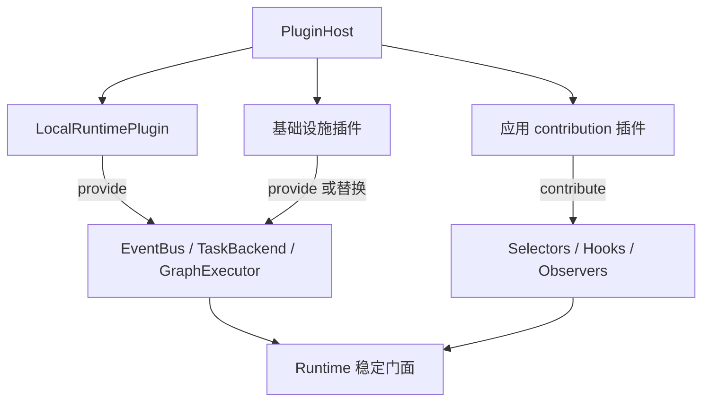
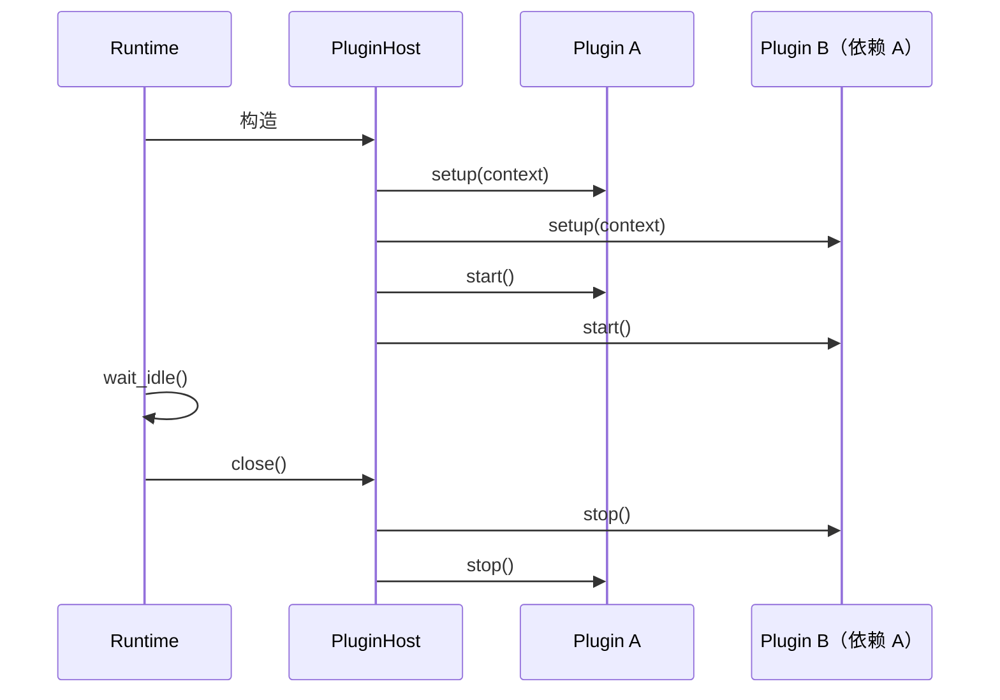
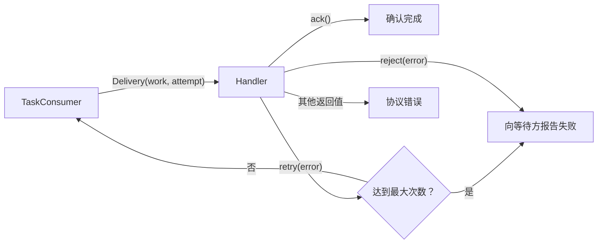

# 第七章：插件、SPI 与适配器开发

本章面向插件作者和基础设施适配器作者。开始前应先理解[Runtime 内部架构](06-runtime-architecture.md)中的角色与
能力端口；普通业务 Graph 不需要使用本章 API。

## 统一插件宿主

需要向 Runtime 注册 selector、Hook 或 Observer 时，优先声明 contribution 插件。插件通过 `PluginDescriptor`
声明身份、版本、依赖和 capability，并在 `setup()` 中
注册能力；全部插件 setup 完成后才依赖顺序调用 `start()`，关闭时逆序调用 `stop()`：

```python
from bricks import Runtime
from bricks.plugins import ContributionPlugin, NodeHookContribution

contributions = ContributionPlugin(
    "acme/crawl",
    selectors={"acme.crawl/ready": ready_selector},
    hooks={
        "acme.crawl/cache": NodeHookContribution(
            cache_hook,
            graph="crawl.graph",
            node="request",
        )
    },
    observers={"acme.crawl/tracing": trace_observer},
)

runtime = Runtime(plugins=(contributions,))
```

`Runtime()` 会自动补入 `LocalRuntimePlugin`。因此 EventBus、TaskBackend、GraphExecutor、Router 和 Worker 的默认
内存组合也是普通内建插件，而不是 Runtime 的隐藏特例。插件只从 `PluginContext` 取得已声明 capability，不应读取
Runtime、Router 或 Worker 的私有字段。

单例 capability 只能有一个 provider；InputSelector、NodeHook 和 RuntimeObserver 是可聚合的具名 contribution。
插件 ID 和 contribution 名必须带命名空间。`PluginDescriptor.api_version` 声明所需的插件 SPI 主版本，当前为
`"1"`。缺失/循环依赖、API 不兼容、能力冲突或 descriptor 声明未兑现都会在 Runtime 构造期间失败。

`PluginHost` 当前只负责显式传入的可信 Python 插件，不会扫描环境或在 import 时自动执行第三方代码。需要配置驱动
发现时，应在应用 composition root 中完成包发现和白名单选择，再把实例交给 Runtime。



### 自定义基础设施

需要替换基础设施但仍使用标准 Router/Worker 时，优先配置内建装配插件：

```python
from bricks import Runtime
from bricks.runtime import LocalRuntimePlugin

local = LocalRuntimePlugin(
    events=my_event_bus,
    tasks=my_task_backend,  # 同时实现 TaskPublisher 与 TaskConsumer
    executor=my_graph_executor,
)
runtime = Runtime(plugins=(local,))
```

这些注入组件默认由调用方管理；只有确认组件为该插件独占时才传 `close_injected=True`。

Router 与 Worker 需要独立部署或不由同一个进程插件管理时，仍可显式组装：

```python
from bricks import Runtime
from bricks.runtime import EventRouter, GraphWorker

router = EventRouter(
    events=my_event_bus,
    publisher=my_task_publisher,
)
worker = GraphWorker(
    consumer=my_task_consumer,
    executor=my_graph_executor,
    emit=router.publish,
)
runtime = Runtime(router=router, worker=worker)
```

`EventRouter`、`GraphWorker` 和底层协议是高级组合接口，不属于顶层 `bricks` 公共 API。应用侧的 Graph、Node、
Event 和 Runtime 门面用法不需要因此改变。`Runtime()` 仍会经 LocalRuntimePlugin 创建完整的默认内存组合。

窄角色协议从 `bricks.spi` 导入，随包提供的本地实现从 `bricks.adapters` 导入：

```python
from bricks.adapters import memory
from bricks.spi import EventBus, GraphExecutor, TaskConsumer, TaskPublisher

events = memory.EventBus()
tasks = memory.TaskBackend()
```

`bricks.spi` 只定义角色和跨适配器数据模型；`bricks.adapters` 只放具体部署实现。`TaskBackend` 仅是
`TaskPublisher` 与 `TaskConsumer` 的便利组合，不代表 EventBus 或 GraphExecutor。

| 协议 | 负责什么 | 默认实现 |
| --- | --- | --- |
| `EventBus` | Event 订阅、发布、投递空闲与关闭 | `memory.EventBus` |
| `TaskPublisher` | 向命名队列提交 Work | `memory.TaskBackend` |
| `TaskConsumer` | 调度带 Slot 的 Work，并控制当前实例的本地并发 | `memory.TaskBackend` |
| `TaskBackend` | 同时实现发布与消费的组合协议 | `memory.TaskBackend` |
| `GraphExecutor` | 执行已冻结 Graph 并返回终端 Output | `Engine` |
| `HookableGraphExecutor` | GraphExecutor 的可选动态 Hook 能力 | `Engine` |

## 适配器的最低要求

EventBus 和 TaskConsumer 必须实现 `idle`、`wait_idle(timeout)` 和 `close()` 所表达的本实例生命周期语义；
TaskPublisher 的 `submit()` 正常返回即表示后端已接受 Work，同时提供 `close()` 释放发布端资源。GraphExecutor
提供 `execute()` 和 `close()`。角色依赖这些方法完成自身的等待与关闭。

- EventBus 的 `subscribe(event_type, handler, subscription=...)` 需要支持精确类型和 `"*"` 通配订阅。同名
  subscription 的多个实例竞争消费，不同 subscription 各自收到一份；省略 subscription 的观察者相互独立。
  Event 携带内部 Slot lease 时，EventBus 从 `publish()` 调用开始接管该引用，并在所有 handler 投递结束或发布
  失败时释放；默认 `memory.EventBus` 已实现该约束。
- TaskPublisher 把 Work 提交到命名 queue，`submit()` 正常返回表示后端已经接受；同一进程内 TaskConsumer 的
  `bind(queue, handler, concurrency=..., slots=...)` 在调度根 Work 前从 SlotPool 获取 lease，延续 Work 则保留
  自身 lease。等待 Slot 的根 Work 不能占用 concurrency，Work 完成或失败后必须释放它持有的 lease。
- GraphExecutor 接收注册名、冻结 Graph、入口输入、Event emitter、可选 ExecutionPlan，以及关键字参数
  `slot=` 和 `execution=`。GraphWorker 会把冻结后的 Node timeout 快照绑定到 Execution；替换执行器必须为每次
  Node firing 使用 `with execution.step(node_id): ...` 包住完整调用，并在调度边界调用
  `execution.checkpoint()`，从而保留步数、取消和 timeout 语义。自定义执行器若还实现
  `HookableGraphExecutor` 的 `attach()`，`Runtime.attach()` 会按结构化能力委托给它。

可参考 [test_runtime_spi.py](../tests/engine/test_runtime_spi.py) 中的同步替身：它验证三个能力可独立替换，也验证
Runtime 不依赖默认内存实现的私有字段。

## 语义必须由适配器声明

协议刻意没有规定序列化、持久化、确认或重试策略。因此 Redis、RabbitMQ、数据库任务表等适配器必须在自己的
文档中明确：

- 事件和 Work 的投递语义（至多一次、至少一次等）；
- 哪一方确认消息、何时重试、失败放到哪里；
- `wait_idle()` 在分布式场景下具体表示什么；
- `close()` 是停止接收、排空本地任务，还是等待远程 broker 完成；
- payload 的序列化限制，以及幂等性由谁保证。
- `Work.limits` 与 execution ID 如何跨进程传递，取消请求如何送达执行进程。

不要仅因适配器名为 Redis 或 MQ 就暗示这些能力已经存在。领域 ID、去重和外部副作用的幂等性仍应由领域模型
显式实现。

`Slot`、`SlotPool` 和内部 lease 只具有进程内语义，不随 Work 跨进程序列化。远程 TaskPublisher 必须用 Graph 名、
输入、Work ID、limits 和不含 lease 的领域 Event 重建传输数据；接收端 TaskConsumer 把它作为新的本地根 Work，
从本地 SlotPool 获取 Slot。跨进程适配器不得宣称延续了源进程的 Slot。

## 分离 Router 与 Worker

`route()` 只负责把 Event 转成 Work 并投递到 queue，`consume()` 只负责消费 queue 并执行 Work 指定的 Graph：

```python
# Router 不需要注册目标 Graph。
router = EventRouter(events=events, publisher=tasks)
router.route("order.created", graph="order.process", queue="orders")

# Worker 不需要订阅源 Event；同一 queue 可以启动多个 Worker 竞争消费。
worker = GraphWorker(consumer=tasks, emit=router.publish)
worker.register("order.process", order_graph)
worker.consume("orders", concurrency=8)
```

`route()` 默认生成稳定的 `route:{event_type}:{graph}:{queue}` subscription，也可通过 `subscription=` 显式指定。
多个 Router 注册同一条 route 时属于同一逻辑订阅，只应由其中一个实例投递 Work。

`on(event_type, graph=..., queue=..., concurrency=...)` 是 Runtime 上组合 `consume()` 与 `route()` 的常用入口。
它先准备本地消费者，再暴露 Event route，避免消费端配置失败后留下仍会投递 Work 的 route。
`observe(event_type, handler)` 独立用于观察 Event。只有需要独立部署 Router 和 Worker，或多条 route 共享一次
queue 消费配置时，才需要显式调用 `route()` 与 `consume()`。

## 组件生命周期

插件模式下，PluginHost 按依赖顺序调用所有插件的 `setup()`，再按相同顺序调用 `start()`；任一阶段失败都会逆序
调用已进入 setup 的插件 `stop()`。`Runtime.close()` 排空工作后关闭 PluginHost，宿主再逆序停止插件。



LocalRuntimePlugin 自己创建的 `memory.EventBus`、`memory.TaskBackend` 和 Engine 由插件关闭；通过其构造器注入的组件
默认由调用方管理，`close_injected=True` 才表示插件接管所有权。

EventRouter 和 GraphWorker 只自动关闭自己创建的默认组件。注入的 EventBus、TaskPublisher、TaskConsumer 和
GraphExecutor 默认由调用方管理，这使多个角色可以安全共享客户端或连接池。若注入组件明确由某个角色独占，
可对该角色传 `close_injected=True`。同一共享组件不要同时交给两个角色管理。

`Runtime(router=..., worker=...)` 显式拥有两个传入角色，`Runtime.close()` 会依次关闭 Worker 和 Router；
角色底层注入组件是否被关闭仍由各自的 `close_injected` 决定。插件模式与显式角色模式不能在同一个 Runtime
构造器中混用。

TaskConsumer 的 `idle` 和 `wait_idle()` 只描述当前消费实例能够跟踪的工作，不是分布式系统的全局完成屏障。
TaskPublisher 的 `submit()` 正常返回只表示后端接受 Work，不等待远端消费者执行完成。

## 可确认的 Work 交付

TaskConsumer 向 handler 交付 `Delivery`，其中包含 `work` 和从 1 开始的 `attempt`。handler 返回：

- `DeliveryResult.ack()`：执行成功，可以确认；
- `DeliveryResult.retry(error)`：请求重新投递；
- `DeliveryResult.reject(error)`：永久拒绝，并向等待方报告错误。

默认内存适配器支持立即重试，默认最多交付 3 次，可用 `memory.TaskBackend(max_delivery_attempts=...)` 调整。
handler 必须返回一个 `DeliveryResult`；缺少返回值或返回其他类型属于协议错误。
持久任务适配器应自行实现 consumer lease、visibility timeout、redelivery、最大重试次数和 dead-letter 策略；核心协议不宣称
这些能力已经由接口自动提供。



## Runtime 观测

`Runtime.observe_runtime(observer)` 订阅 execution、Node、Event 和 Work 的只读生命周期事实。事件不包含业务输入输出，
observer 抛出的异常会被隔离，因此日志、Tracing 和指标插件不能改变 Graph 结果。返回的 handle 可用 `detach()` 卸载。

固定随 Runtime 启动的观察者可通过 `ContributionPlugin(observers={"namespace/name": observer})` 贡献；运行期间临时
安装或需要主动卸载的观察者继续使用 `observe_runtime()`。

## 输入策略 contribution

构造期固定策略优先通过 `ContributionPlugin(selectors={"namespace/name": selector})` 贡献；动态配置也可以先调用
`runtime.register_policy(name, selector)`。selector 只能读取端口名称、各端口可用 token 数和冻结配置，返回本次
各消费一个 token 的端口元组或 `None`。Graph 注册时会绑定 selector 快照；缺失、重复、空端口或不存在端口的选择
都会失败。因此两种方式都必须发生在使用该策略的 Graph 注册之前。默认 Runtime 中应先 `runtime.register()` 冻结
Graph，再调用 `graph.plan()`；自行组装 Runtime 时也可以显式将同一 `PolicyRegistry` 交给 GraphWorker 和
`graph.plan(..., policies=registry)`。

## 动态 Node Hook

Graph 注册后保持冻结，但默认 `Engine` 允许使用者给后续 Graph execution 动态挂载 Hook：

```python
from bricks import Output
from bricks.engine.hooks import NodeCall, NodeHook, ShortCircuit


class RequestCache(NodeHook):
    async def enter(self, call: NodeCall) -> NodeCall:
        response = await cache.get(call.inputs["request"])
        if response is not None:
            raise ShortCircuit(Output(response, "response"))
        return call

    async def exit(self, call, outputs):
        await cache.put(call.inputs["request"], outputs[0].value)
        return outputs


handle = runtime.attach(
    RequestCache(),
    graph="crawl.graph",
    node="request",
)
handle.detach()
```

`enter()` 转换 Node 输入，`exit()` 转换结果，`error()` 可以返回结果来恢复普通异常。三者都可以是同步或异步方法；
Engine 把 awaitable 提交给常驻后台 event loop，并在执行 Graph 的 worker 中等待结果。Hook 无需、也不能手动推进
Node 执行：`enter()` 正常返回后 Engine 默认执行 Node。

单阶段转换不需要定义 class：

```python
def normalize(call, outputs):
    return tuple(Output(clean(item.value), item.port) for item in outputs)


handle = runtime.attach(
    normalize,
    phase="exit",
    graph="crawl.graph",
    node="parse",
)
```

`phase` 可以是 `"enter"`、`"exit"` 或 `"error"`，省略时函数作为 `enter` Hook。注册范围可以是全部 Graph、
指定 Graph，或者指定 Graph 内的 Node；Node 范围必须同时给出 Graph 名。

固定 Hook 可以通过 `ContributionPlugin` 的具名 `NodeHookContribution` 安装。插件 Hook 可在目标 Graph 注册前声明，
LocalRuntimePlugin 会延迟绑定，并在 Graph 注册时校验目标 Node；运行期 `runtime.attach()` 仍要求目标 Graph 已注册，
并返回可卸载句柄。

Hook 通过两个信号显式改变流程：

- `ShortCircuit(*outputs)` 只能从 `enter()` 发出。它跳过当前 Node，把 outputs 当作该 Node 的结果，经过
  当前 Node 的 output port/type 校验后继续走既有 Edge。
- `StopGraph(*outputs)` 可以从任意 Hook 阶段发出。它立即停止整个 Graph，并直接返回携带的终端 outputs；
  当前 Graph 没有 graph-level output schema，因此只校验它们是 `Output`。

Hook 按注册顺序进入、逆序退出。短路后，已经进入的 Hook 仍会执行 `exit()`；终止 Graph 则不会继续执行剩余
生命周期。每次 Graph execution 在开始时固定 Hook 快照，所以 `attach()`/`detach()` 不会改变已经在途的执行，
但会作用于下一次执行。`detach()` 是幂等的，也不会等待旧快照结束。

Hook 最终产生的结果仍受 Graph 契约约束：除 `StopGraph` 的整图终端结果外，Hook 不能产生未声明的 output port
或错误类型，也不能替换 Graph、Node、Context，或增删 Node input port。

[上一章：Runtime 内部架构](06-runtime-architecture.md) · [下一章：编排模式](08-patterns.md)
