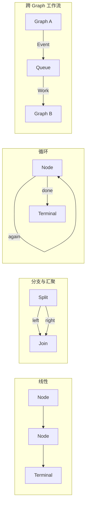

# 第八章：编排模式

本章把前面的概念组合成常见结构。所有模式都有对应的可运行示例：

```bash
uv run python examples/linear.py
uv run python examples/fan_in.py
uv run python examples/cycle.py
uv run python examples/event_routing.py
uv run python examples/async_node.py
uv run python examples/output_stream.py
```

先用一张图识别最常见的四种拓扑；后面的示例再分别展示其端口和执行语义：



## 1. 线性处理

[`examples/linear.py`](../examples/linear.py) 展示最常见的数据处理链：一个 Node 的 Output 经 Edge 交给下一
个 Node。只有没有下游 Edge 的 Output 才会由 `Runtime.run()` 返回。

```python
graph = (
    Graph(entrypoint="strip")
    .add(strip=Strip(), upper=Upper())
    .connect("strip", "upper", source_port="text", target_port="text")
)

with Runtime() as runtime:
    runtime.register("linear", graph)
    outputs = runtime.run("linear", "  hello  ")
```

当两个 Node 都使用默认端口名 `default` 时，`.connect("strip", "upper")` 即可。端口名不同则显式传入
`source_port` 和 `target_port`。

## 2. 分支与汇聚

[`examples/fan_in.py`](../examples/fan_in.py) 中 `Split` 一次产生 `left` 与 `right` 两项 Output；`Add` 使用
`InputPolicy.ALL`，只有两个输入各到达一个值后才执行。

```python
graph = (
    Graph(entrypoint="split")
    .add(split=Split(), add=Add())
    .connect("split", "add", source_port="left", target_port="left")
    .connect("split", "add", source_port="right", target_port="right")
)
```

若 `ALL` Node 只收到部分输入，Graph 停止时会抛出 `IncompleteInputsError`，而不是悄悄丢弃数据。

### 2.1 Keyed join

`ALL` 是按每个端口 FIFO 取值的 positional join，不会读取业务 key。乱序相关数据应使用官方扩展：

```python
from bricks.extensions import KeyedJoin, KeyedValue

join = KeyedJoin(max_pending=10_000)
```

`KeyedJoin` 接收 `left` 和 `right` 两个 `KeyedValue`，只配对 key 相同的值；同 key 的重复值保持 FIFO。状态隔离在
当前 execution 和 node binding 内。图静止时仍有未配对值会抛出 `IncompleteInputsError`，缓存超过 `max_pending`
则抛出 `OverflowError`，不会静默错配或无限增长。

`InputPolicy.ANY` 适合“任一输入到达即可处理”的消费者；它按 Ports 声明顺序从第一个就绪端口取一个值，因此
Node 必须能根据实际存在的 key 区分输入来源。

## 3. 循环

[`examples/cycle.py`](../examples/cycle.py) 展示一个自环。`again` 端口连接回 `Counter` 自身，`done` 没有下游，
所以它产生终端输出：

```python
graph = (
    Graph(entrypoint="counter")
    .add(counter=Counter())
    .connect("counter", "counter", source_port="again", target_port="value")
)
```

环是普通 Edge 结构，不需要特殊配置，也没有默认执行次数或时长限制。Node 不再向回路输出数据后，Graph 自然
进入静止并结束。

## 4. 用事件连接 Graph

[`examples/event_routing.py`](../examples/event_routing.py) 将同步的发布 Graph 与队列中的消费 Graph 分开：

```python
runtime.register("producer", producer)
runtime.register("consumer", consumer)
runtime.on(
    "message.created",
    graph="consumer",
    queue="messages",
    concurrency=2,
)

runtime.run("producer", "hello")
runtime.wait_idle()
```

发布 Node 使用 `context.emit("message.created", value)`。这不是 Graph 内 Output 的替代物：事件用于表达已发生
的事实，并可能启动多张 Graph；`wait_idle()` 确保已接受的级联任务完成后再读取结果。

## 5. 异步 Node

[`examples/async_node.py`](../examples/async_node.py) 展示 `AsyncNode`。它与 `Node` 有相同的 Ports、Output、
Edge 和 InputPolicy，只是 `execute()` 是 `async def`：

```python
class DelayedUpper(AsyncNode):
    input_ports = Ports(text=str)
    output_ports = Ports(result=str)

    async def execute(self, inputs, context):
        await asyncio.sleep(0.01)
        return Output(inputs["text"].upper(), "result")
```

队列路由中的 `concurrency` 限制整张 Graph 的同时执行数。对于单个需要等待 I/O 的 Node，继承 `AsyncNode`；
对于多份彼此独立的工作，使用 Event 路由和命名队列。

## 6. 流式终端输出

[`examples/output_stream.py`](../examples/output_stream.py) 展示一个 Graph 产生多个 terminal Output 时的同步与异步
消费方式：

```python
execution = runtime.start("output-stream", 4, output_buffer=2)

for output in execution:
    print(output.value)

all_outputs = execution.result()
```

异步代码可以直接迭代 Runtime 便利接口，也可以 await Execution 获取最终结果：

```python
async for output in runtime.aiter("output-stream", 4):
    print(output.value)

outputs = await runtime.start("output-stream", 4)
```

`output_buffer` 限制活跃消费者的未读窗口。流式迭代结束后，Execution 仍保留完整 terminal Output tuple。

[上一章：插件与扩展开发](07-plugins.md)
