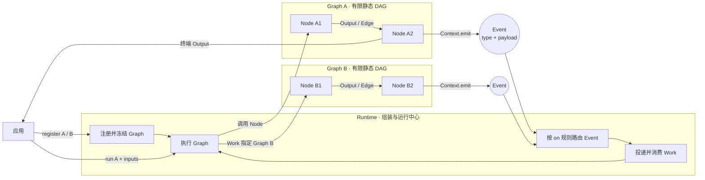
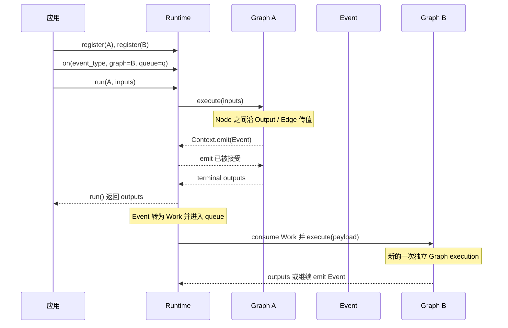
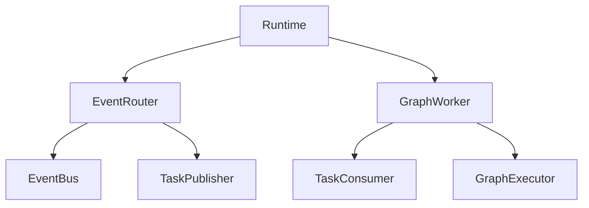
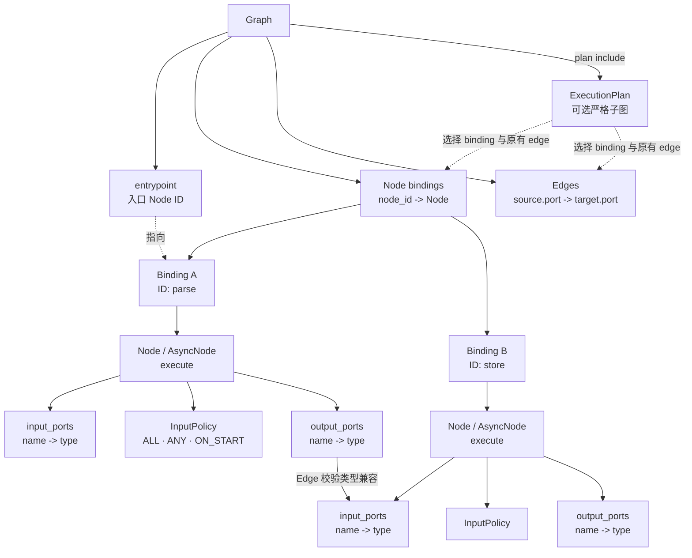
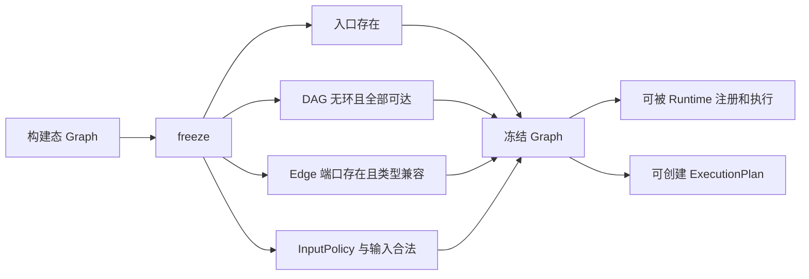
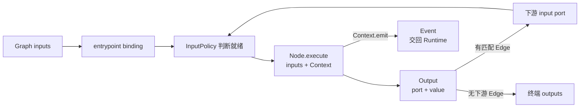

# 核心架构

Bricks 把系统分成两条不会隐式互转的通路：Graph 内使用 `Output` 和 `Edge` 传值；Graph 间使用 `Event`
触发新的 Work。`Runtime` 是两条通路的组装入口，不亲自实现消息传输、队列或 Graph 执行。

## 核心概念关系



三者的关系是：

- `Graph` 定义一次有限的局部计算，内部只通过 `Output / Edge` 传值。
- `Event` 是 Graph 对外发布的领域事实，也是跨 Graph 连接的唯一数据对象。
- `Runtime` 注册并执行 Graph，接收 Event，再根据 `on()` 规则异步启动另一张 Graph。

Graph 彼此不直接引用，也不直接调用。上图中的核心闭环是：

```text
Runtime.run(Graph A)
    -> Graph A 内部执行
    -> Graph A emit Event
    -> Runtime 路由 Event
    -> Runtime 执行 Graph B
    -> Graph B 可以继续 emit Event
```

## 一次完整运行



这里最重要的运行边界是：Graph B 不会在 Graph A 的 `Context.emit()` 调用栈中执行。`emit()` 只表示 Runtime
的事件传输已经接受 Event，后续 Work 是一次独立的 Graph execution。

## Runtime 如何组装



`Runtime` 只是 composition root。Router 负责 `Event -> Work`，Worker 负责 `Work -> Graph execution`；四个
底层能力都可以独立替换。

## Graph 如何组装



Graph 保存的是三类静态信息：入口 ID、`node_id -> Node` binding，以及端口到端口的 Edge。Node ID 属于
binding，不属于 Node，因此同一个无状态 Node 实例可以在不同位置复用。

```python
graph = (
    Graph(entrypoint="parse")
    .add(parse=Parse(), store=Store())
    .connect("parse", "store", source_port="result", target_port="value")
)
```

这段定义对应：

```text
entrypoint = "parse"

bindings:
  "parse" -> Parse()
  "store" -> Store()

edge:
  parse.output_ports["result"] -> store.input_ports["value"]
```

`freeze()` 或 `Runtime.register()` 会把构建态 Graph 变成可执行定义，并统一校验：



## Graph 如何执行



`Ports` 声明输入输出的名称和类型，`InputPolicy` 决定 Node 何时可以消费输入。`Output` 只沿当前 Graph 的
`Edge` 传播；`Context.emit()` 产生的 `Event` 则离开当前 Graph，交回 Runtime 进入跨 Graph 流程。

## 组装关系

| 层次 | 核心概念 | 责任 |
| --- | --- | --- |
| 用户模型 | `Ports`、`Node`、`Output`、`Edge`、`Graph`、`Event`、`Context`、`Slot` | 描述业务行为、数据流和逻辑执行状态 |
| 顶层门面 | `Runtime` | 注册和直接执行 Graph，组合事件路由与本地消费，管理生命周期 |
| 内部角色 | `EventRouter`、`GraphWorker` | 分别组装事件发布/Work 投递，以及 Work 消费/Graph 执行 |
| 能力端口 | `EventBus`、`TaskPublisher`、`TaskConsumer`、`GraphExecutor` | 隔离事件传输、任务通道和执行实现 |
| 默认实现 | `MemoryEventBus`、`MemoryTaskBackend`、`Engine` | 提供单进程同步事件分发、线程池消费和 typed Graph 执行 |

`Runtime()` 默认把一套内存组件连接好。高级部署可以分别创建 Router 和 Worker，并替换任意能力端口。

## 完整流程

1. 应用用 `Graph.add(node_id, node)` 或 `Graph.add(parse=..., store=...)` 建图；Node ID 只标识 Graph 中的
   binding，Node 行为本身可以复用。
2. `Runtime.register(name, graph)` 冻结并校验 Graph，包括入口、DAG、可达性、Ports 类型和 InputPolicy。
3. `Runtime.run()` 直接把注册名和输入交给 GraphExecutor；`ExecutionPlan` 可以把本次执行限制在严格子图中。
4. Executor 按 InputPolicy 组合输入并调用 Node。Node 返回的 `Output` 沿 `Edge` 进入下游端口；没有下游的
   Output 成为 `run()` 的返回值。
5. Node 可以通过 `Context.emit()` 发布 `Event`，应用也可以通过 `Runtime.emit()` 发布；Event 不会隐式变成
   Graph 内的 Output。
6. `observe(event, handler)` 是普通 EventBus 订阅，直接调用同步 handler，不创建 Work，也不执行 Graph。
7. `on(event, graph, queue, concurrency, slots)` 组合 `route()` 和 `consume()`：route 把匹配的 Event 转成
   `Work` 并 submit 到命名 queue；consume 以本实例 concurrency 和 SlotPool 绑定 queue。
8. TaskConsumer 取得 Work 后调用 GraphWorker；Worker 根据 Work 中的 Graph 注册名找到冻结 Graph，再交给
   GraphExecutor 执行。目标 Graph 不在源 Node 的 `emit()` 调用栈中执行。
9. 目标 Graph 可以继续 emit Event，形成跨 Graph 的事件链；当前 Slot 随下游 Work 跨 Consumer 传递，所有分支
   结束后归还池。`wait_idle()` 等待当前 Runtime 能观察到的事件与
   Work 级联静止；`close()` 先排空再按所有权关闭组件。

## API 意图

```python
# 普通同步观察，不进入 queue。
runtime.observe("order.created", audit)

# 常用入口：Event -> Work -> queue -> Graph。
runtime.on(
    "order.created",
    graph="order.process",
    queue="orders",
    concurrency=8,
)

# 高级入口：Router 和 Worker 可以分开部署或分别配置。
runtime.route("order.created", graph="order.process", queue="orders")
runtime.consume("orders", concurrency=8)
```

默认内存实现不提供持久化、ack、重试、跨进程恢复或 exactly-once。替换 EventBus 或任务后端时，这些保证仍需
由适配器明确声明；领域去重和外部副作用幂等仍由应用负责。
